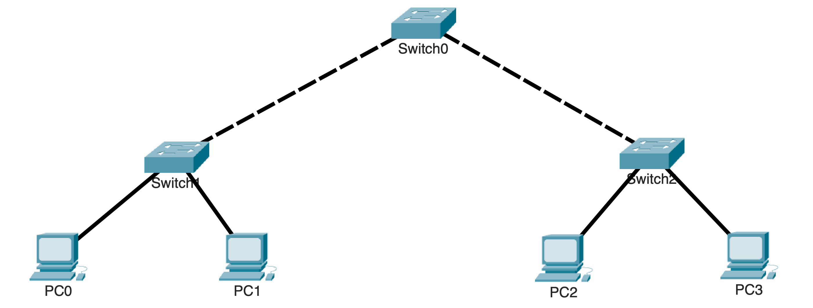
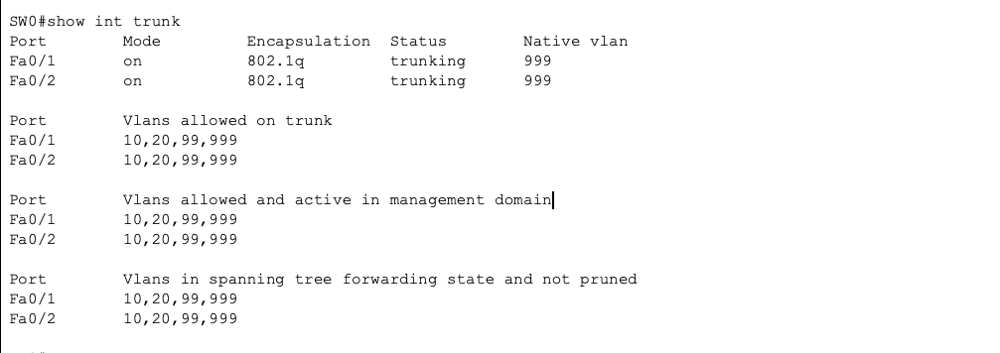
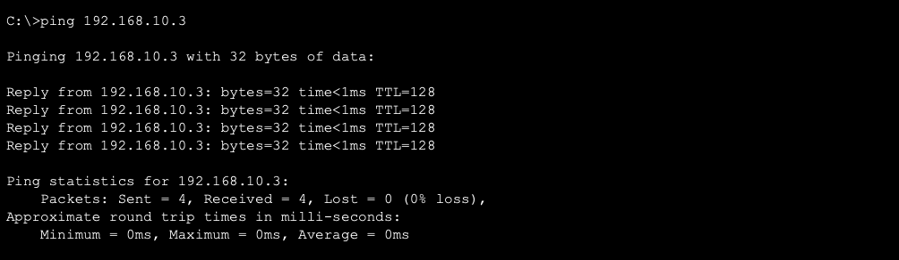
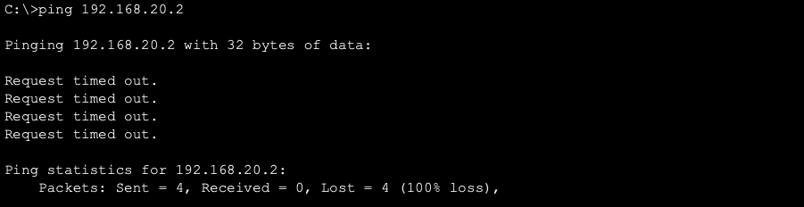

# VLAN Segmentation & 802.1Q Trunking

## Overview

This lab demonstrates how VLANs segment a switched network into separate Layer 2 broadcast domains and how 802.1Q trunk links carry traffic for multiple VLANs between switches.

Devices in the same VLAN can communicate across trunk links, while communication between different VLANs is prevented because no Layer 3 routing is configured.

---

## Objectives

- Create and configure VLANs
- Assign access ports to the appropriate VLANs
- Configure 802.1Q trunk links
- Configure a dedicated native VLAN
- Restrict allowed VLANs on trunk links
- Verify VLAN configuration
- Verify trunk operation
- Validate Layer 2 connectivity

---

# Network Topology



---

## VLAN Design

| VLAN | Name | Purpose |
|------|------|---------|
| 10 | HR | Human Resources |
| 20 | IT | Information Technology |
| 99 | Management | Switch Management |
| 999 | Native | Native VLAN |

---

## Device Addressing

| Device | Interface | IP Address | Subnet Mask | VLAN |
|---------|-----------|------------|-------------|------|
| PC0 | FastEthernet0 | 192.168.10.1 | 255.255.255.0 | 10 |
| PC1 | FastEthernet0 | 192.168.20.2 | 255.255.255.0 | 20 |
| PC2 | FastEthernet0 | 192.168.10.3 | 255.255.255.0 | 10 |
| PC3 | FastEthernet0 | 192.168.20.4 | 255.255.255.0 | 20 |

---

# Configuration

The following tasks were completed during this lab:

- Created VLANs 10, 20, 99, and 999
- Assigned access ports to the appropriate VLANs
- Configured 802.1Q trunk links between switches
- Configured VLAN 999 as the native VLAN
- Restricted trunk links to carry only VLANs 10, 20, 99, and 999

---

# Verification

### VLAN Configuration

Verified that the VLANs were created and that access ports were assigned correctly.

```text
show vlan brief
```


---

### Trunk Configuration

Verified that the trunk links were operational, using the correct native VLAN, and carrying the required VLANs.

```text
show interfaces trunk
```



---

### Connectivity Testing

Devices in the same VLAN successfully communicated across the trunk links.



Devices in different VLANs were unable to communicate because no Layer 3 routing was configured.



---

# Key Takeaways

- VLANs divide a switched network into separate Layer 2 broadcast domains.
- Access ports determine which VLAN a connected device belongs to.
- 802.1Q trunk links carry traffic for multiple VLANs between switches.
- The native VLAN must match on both ends of a trunk.
- Restricting allowed VLANs limits trunk traffic to only the required VLANs.
- Communication between different VLANs requires Layer 3 routing.


---

# Environment

- Cisco Packet Tracer
- Cisco IOS
