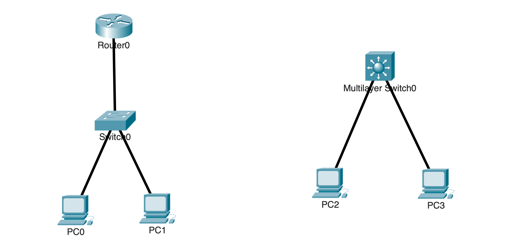
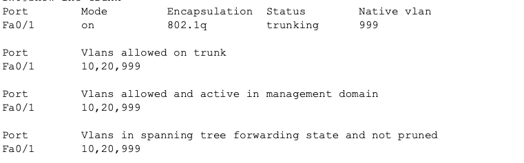
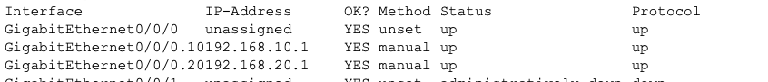
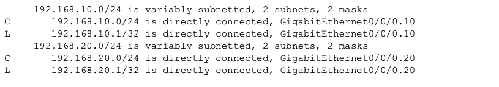
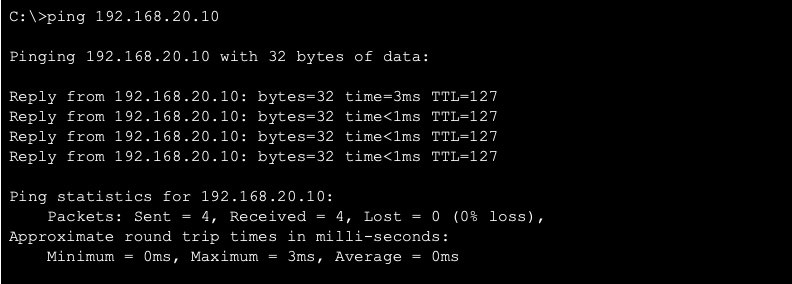
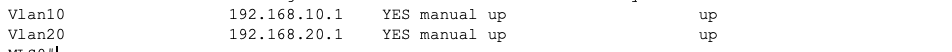
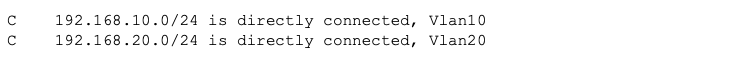
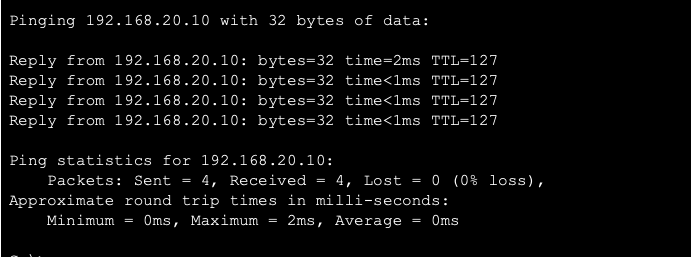

# Inter-VLAN Routing: Router-on-a-Stick & SVIs

## Overview

This lab demonstrates two methods of routing traffic between VLANs so devices in separate Layer 2 networks can communicate:

- Router-on-a-Stick (ROAS) using router subinterfaces over an 802.1Q trunk
- Switch Virtual Interfaces (SVIs) using Layer 3 interfaces on a multilayer switch

Two disconnected networks were built using the same VLANs and addressing plan. One network uses Router-on-a-Stick, while the other uses SVIs, allowing each method to be configured and tested separately. Because the networks are not connected, the same VLAN IDs and IP addresses can be used in both without causing conflicts.

---

## Objectives

- Separate Sales and Engineering hosts into different VLANs
- Configure Router-on-a-Stick using an 802.1Q trunk and router subinterfaces
- Configure inter-VLAN routing using SVIs on a multilayer switch
- Verify Layer 3 interfaces and directly connected routes
- Test communication between VLAN 10 and VLAN 20
- Compare router-based and multilayer-switch routing

---

## Topology



### Router-on-a-Stick Network

- **R0** provides the VLAN gateways through subinterfaces
- **SW0** connects the VLANs to R0 through an 802.1Q trunk
- **PC0** belongs to VLAN 10
- **PC1** belongs to VLAN 20

### SVI Network

- **MLS0** provides the VLAN gateways through SVIs
- **PC2** belongs to VLAN 10
- **PC3** belongs to VLAN 20

The two networks are not connected and were tested separately.

---

## Network Design

| VLAN | Name | Network | Gateway |
|---|---|---|---|
| 10 | Sales | `192.168.10.0/24` | `192.168.10.1` |
| 20 | Engineering | `192.168.20.0/24` | `192.168.20.1` |
| 999 | Native | N/A | N/A |

PC0 and PC2 use `192.168.10.10/24`, while PC1 and PC3 use `192.168.20.10/24`.

The duplicate addresses are valid because the two networks are disconnected.

---

## Configuration

### Router-on-a-Stick

SW0 was configured with VLAN access ports and an 802.1Q trunk toward R0.

```cisco
vlan 10
 name Sales

vlan 20
 name Engineering

vlan 999
 name Native

interface FastEthernet0/1
 switchport mode trunk
 switchport trunk native vlan 999
 switchport trunk allowed vlan 10,20,999

interface FastEthernet0/2
 switchport mode access
 switchport access vlan 10

interface FastEthernet0/3
 switchport mode access
 switchport access vlan 20
```

R0 was configured with one subinterface for each routed VLAN.

```cisco
interface FastEthernet0/0/0
 no shutdown

interface FastEthernet0/0/0.10
 encapsulation dot1Q 10
 ip address 192.168.10.1 255.255.255.0

interface FastEthernet0/0/0.20
 encapsulation dot1Q 20
 ip address 192.168.20.1 255.255.255.0
```

Each subinterface provides the default gateway for its corresponding VLAN.

---

### Switch Virtual Interfaces

MLS0 was configured with VLAN access ports, SVIs, and Layer 3 routing.

```cisco
vlan 10
 name Sales

vlan 20
 name Engineering

interface FastEthernet0/1
 switchport mode access
 switchport access vlan 10

interface FastEthernet0/2
 switchport mode access
 switchport access vlan 20

interface vlan 10
 ip address 192.168.10.1 255.255.255.0
 no shutdown

interface vlan 20
 ip address 192.168.20.1 255.255.255.0
 no shutdown

ip routing
```

The SVIs provide the VLAN gateways, while `ip routing` allows MLS0 to forward traffic between the two VLAN networks.

---

## Verification

### ROAS Trunk Verification

The trunk between SW0 and R0 was verified on SW0.

```cisco
show interfaces trunk
```



The output confirmed:

- `Fa0/1` was operating as an 802.1Q trunk
- VLAN 999 was configured as the native VLAN
- VLANs 10, 20, and 999 were allowed and active
- The required VLANs were in the spanning-tree forwarding state

---

### Router Subinterface Verification

The router subinterfaces were verified on R0.

```cisco
show ip interface brief
```



The output confirmed that the VLAN 10 and VLAN 20 subinterfaces were operational and using the correct gateway addresses.

---

### ROAS Routing Table Verification

The routing table was verified on R0.

```cisco
show ip route
```



The output confirmed that the following networks appeared as directly connected routes:

- `192.168.10.0/24`
- `192.168.20.0/24`

---

### ROAS Connectivity Testing

PC0 tested connectivity to PC1 across the VLAN boundary.

```text
PC0> ping 192.168.20.10
```



The successful ping confirmed that R0 routed traffic between VLAN 10 and VLAN 20 through its subinterfaces.

---

### SVI Interface Verification

The VLAN interfaces were verified on MLS0.

```cisco
show ip interface brief
```



The output confirmed that the VLAN 10 and VLAN 20 SVIs were operational and using the correct gateway addresses.

---

### SVI Routing Table Verification

The routing table was verified on MLS0.

```cisco
show ip route
```



The output confirmed that the following networks appeared as directly connected routes:

- `192.168.10.0/24`
- `192.168.20.0/24`

---

### SVI Connectivity Testing

PC2 tested connectivity to PC3 across the VLAN boundary.

```text
PC2> ping 192.168.20.10
```



The successful ping confirmed that MLS0 routed traffic between VLAN 10 and VLAN 20 using its SVIs.

---

## Key Takeaways

- Devices in different VLANs require a Layer 3 gateway to communicate
- Router-on-a-Stick uses router subinterfaces over an 802.1Q trunk
- SVI routing performs inter-VLAN routing directly on a multilayer switch
- Both routing devices installed directly connected routes for the VLAN networks
- Interface and routing-table verification confirms more than connectivity testing alone
- Both methods achieved the same result using different network designs

---

## Environment

- Cisco Packet Tracer
- Cisco IOS
