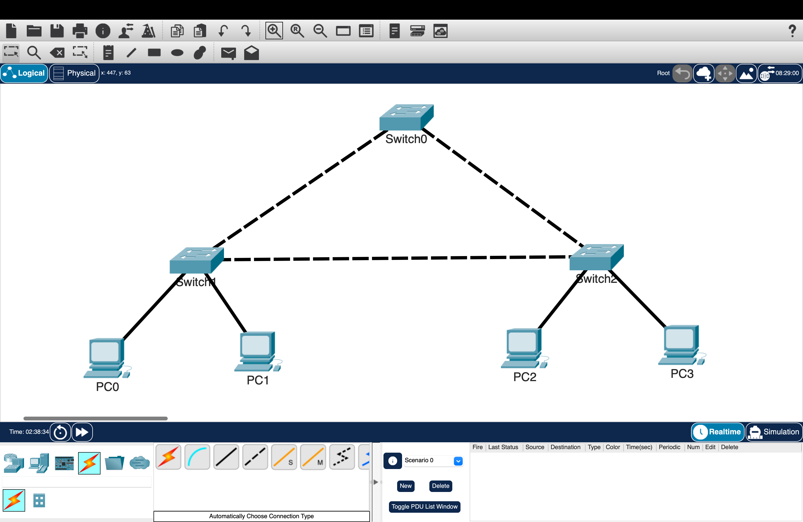
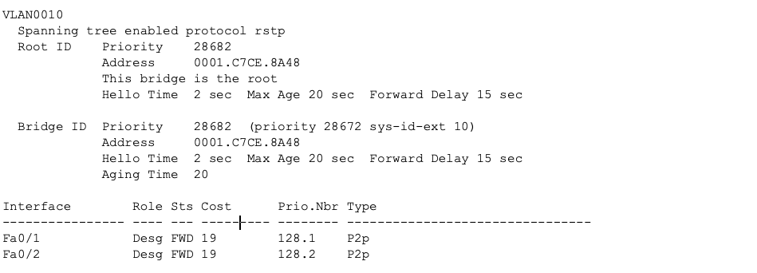
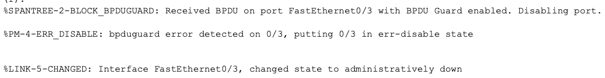

# Spanning Tree Protocol (STP & RSTP)

## Overview

This lab demonstrates how Spanning Tree Protocol (STP) and Rapid Spanning Tree Protocol (RSTP) prevent Layer 2 switching loops in a redundant network topology.

A three-switch redundant topology was built to observe root bridge election, spanning-tree port roles, and port states. Bridge priorities were configured to control which switch became the primary and secondary root bridge. PortFast and BPDU Guard were also configured on the access switch to improve edge network protection.

---

## Objectives

- Build a redundant Layer 2 topology
- Enable Rapid PVST+
- Observe the default root bridge election
- Configure a primary root bridge
- Configure a secondary root bridge
- Identify root, designated, and alternate ports
- Verify forwarding and discarding port states
- Configure PortFast on access ports
- Enable BPDU Guard protection
- Verify BPDU Guard err-disabled behavior
- Confirm that the topology remains loop-free

---

## Network Topology



---

## Switch Roles

| Switch | Role |
|--------|------|
| SW0 | Primary Root Bridge |
| SW1 | Secondary Root Bridge |
| SW2 | Access Switch |

---

## Configuration

The following tasks were completed during this lab:

- Built a redundant three-switch Layer 2 topology
- Enabled Rapid PVST+ on each switch
- Configured SW0 as the primary root bridge
- Configured SW1 as the secondary root bridge
- Enabled PortFast and BPDU Guard on SW2 access ports
- Verified the elected root bridge
- Identified spanning-tree port roles and states
- Confirmed that redundant paths were placed into a discarding state

---

### Rapid PVST+ Configuration

Rapid PVST+ was enabled on all switches:

```cisco
spanning-tree mode rapid-pvst
```

Rapid PVST+ creates a separate spanning-tree instance for each VLAN and provides faster convergence compared to traditional STP.

---

### Primary Root Bridge Configuration

SW0 was configured as the preferred root bridge for VLANs 10 and 20:

```cisco
spanning-tree vlan 10,20 root primary
```

This automatically adjusts the bridge priority so SW0 becomes the root bridge during the spanning-tree election process.

---

### Secondary Root Bridge Configuration

SW1 was configured as the backup root bridge:

```cisco
spanning-tree vlan 10,20 root secondary
```

This provides a backup root bridge if the primary root bridge becomes unavailable.

---

### Access Port Protection Configuration

PortFast and BPDU Guard were enabled on SW2 access ports:

```cisco
spanning-tree portfast default
spanning-tree portfast bpduguard default
```

PortFast allows end devices connected to access ports to transition into the forwarding state immediately instead of waiting through normal STP states.

BPDU Guard protects access ports by placing the interface into an err-disabled state if unexpected BPDUs are received from another switch.

---

## Verification

### Root Bridge Verification

The spanning-tree output was checked on the switches to verify:

- Current root bridge
- Bridge ID
- Bridge priority
- Root path information
- Port roles and states

Command used:

```cisco
show spanning-tree vlan 10
```



---

### Port Role Verification

The spanning-tree output was used to identify root, designated, and alternate ports.

Command used:

```cisco
show spanning-tree vlan 10
```


Observed behavior:

- SW0 became the root bridge for VLANs 10 and 20.
- SW0 interfaces operated as designated ports.
- SW1 and SW2 selected their best path toward the root bridge as their root ports.
- One redundant path was placed into an alternate/discarding state to prevent a Layer 2 loop.

---

### Root Bridge Information Verification

The root bridge information was verified by reviewing the spanning-tree output.

Command used:

```cisco
show spanning-tree root
```


---

### BPDU Guard Verification

BPDU Guard was tested on the access switch (SW2) by introducing BPDU traffic on a PortFast-enabled access port.

When SW2 received an unexpected BPDU on the protected interface, BPDU Guard placed the port into an err-disabled state. This prevents unauthorized switches from affecting the spanning-tree topology.

The interface status was verified using:

```cisco
show interfaces status err-disabled
```

Example interface verification:

```cisco
show interfaces fa0/1
```



---

## Expected Port Behavior

| Port Role | Purpose |
|-----------|---------|
| Root Port | Best path from a non-root switch toward the root bridge |
| Designated Port | Forwarding port responsible for a Layer 2 segment |
| Alternate Port | Backup path placed into a discarding state to prevent loops |

Expected STP behavior:

- The root bridge contains only designated forwarding ports.
- Each non-root switch has one root port toward the root bridge.
- Redundant links are placed into an alternate/discarding state.
- Only the necessary forwarding paths remain active.

---

## Results

The completed topology successfully demonstrated STP loop prevention.

Results:

- SW0 was elected as the root bridge for VLANs 10 and 20.
- SW1 was configured as the secondary root bridge.
- SW2 operated as an access switch with edge protection enabled.
- STP successfully blocked redundant paths to prevent Layer 2 loops.
- Port roles and states were verified using spanning-tree output.
- BPDU Guard successfully placed an access port into an err-disabled state when unexpected BPDUs were detected.

---

## Key Takeaways

- STP prevents Layer 2 loops by controlling which ports forward traffic.
- The switch with the lowest Bridge ID becomes the root bridge.
- Bridge priority can be configured to control root bridge placement.
- Root ports provide the best path toward the root bridge.
- Designated ports forward traffic for their Layer 2 segments.
- Alternate ports provide redundancy while remaining in a discarding state.
- Rapid PVST+ provides faster convergence than traditional STP.
- PortFast improves access device connectivity.
- BPDU Guard protects edge ports from unauthorized switches.

---

## Environment

- Cisco Packet Tracer
- Cisco IOS
