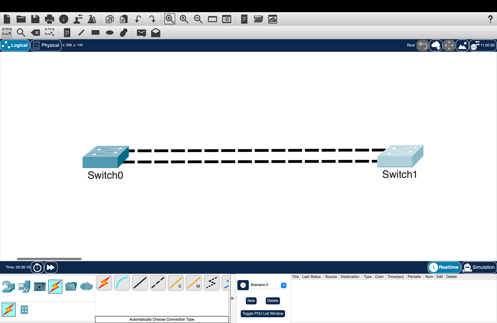
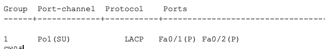
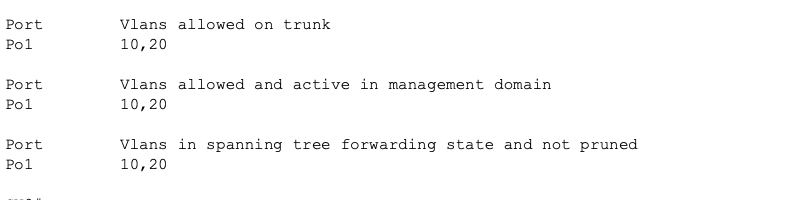
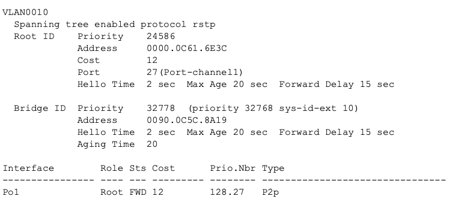

# LACP EtherChannel & 802.1Q Trunking

## Overview

This lab demonstrates how Link Aggregation Control Protocol (LACP) combines multiple physical switch links into a single logical EtherChannel interface.

Two physical FastEthernet links were bundled into a Port-Channel using LACP. The logical Port-Channel interface was configured as an 802.1Q trunk to carry multiple VLANs between switches while allowing Rapid PVST+ to treat the EtherChannel as a single logical path.

---

## Objectives

- Configure LACP EtherChannel between switches
- Bundle multiple physical interfaces into a logical Port-Channel
- Configure 802.1Q trunking on an EtherChannel interface
- Verify EtherChannel negotiation and operation
- Verify VLAN traffic across the trunk
- Verify STP interaction with EtherChannel

---

## Network Topology & Switch Roles



| Switch | Role | Interfaces | Logical Interface | LACP Mode |
|--------|------|------------|-------------------|-----------|
| SW1 | Distribution Switch | Fa0/23 - Fa0/24 | Port-Channel1 | Active |
| SW2 | Access Switch | Fa0/23 - Fa0/24 | Port-Channel1 | Active |

---

## Configuration

The topology was configured with two physical links between SW1 and SW2.

LACP was used to negotiate the EtherChannel bundle, creating a single logical interface:

- Physical interfaces Fa0/23 and Fa0/24 were added to Channel Group 1.
- Port-Channel1 was configured as an 802.1Q trunk.
- VLANs 10 and 20 were allowed across the trunk.

Configuration applied:

```cisco
interface range FastEthernet0/23 - 24
 channel-group 1 mode active

interface Port-Channel1
 switchport mode trunk
 switchport trunk allowed vlan 10,20
```

---

# Verification

## EtherChannel Verification

Verified that the physical interfaces successfully formed an LACP EtherChannel.

Command used:

```cisco
show etherchannel summary
```



The output confirmed:

- Port-Channel1 was operational.
- LACP was being used.
- Fa0/23 and Fa0/24 were successfully bundled into the EtherChannel.
- Member ports displayed the `P` flag, confirming they were active members of the Port-Channel.

---

## Trunk Verification

Verified that the Port-Channel interface was operating as an 802.1Q trunk and carrying the required VLANs.

Command used:

```cisco
show interfaces trunk
```



The output confirmed:

- Port-Channel1 was functioning as a trunk.
- VLANs 10 and 20 were allowed across the trunk.
- The logical interface was carrying multi-VLAN traffic.

---

## STP EtherChannel Verification

Verified that Rapid PVST+ recognized the EtherChannel as a single logical connection.

Command used:

```cisco
show spanning-tree vlan 10
```



The output confirmed:

- STP calculated the topology using Port-Channel1 instead of individual physical links.
- The EtherChannel operated as a single spanning-tree path.
- Redundant physical links were combined without creating a Layer 2 loop.

---

## LACP Modes & Flags

| Mode / Flag | Description |
|-------------|-------------|
| Active | Initiates LACP negotiation with the neighboring switch |
| Passive | Responds to LACP negotiation but does not initiate |
| SU Flag | Layer 2 EtherChannel that is currently in use |
| P Flag | Physical interface successfully bundled into the Port-Channel |

---

# Key Takeaways

- EtherChannel combines multiple physical links into one logical interface.
- LACP provides dynamic negotiation and link aggregation between switches.
- Trunk configurations should be applied to the Port-Channel interface instead of individual member interfaces.
- STP treats an EtherChannel as a single logical link, preventing individual member links from being blocked.
- EtherChannel provides additional bandwidth and redundancy while maintaining a loop-free topology.

---

# Environment

- Cisco Packet Tracer
- Cisco IOS
