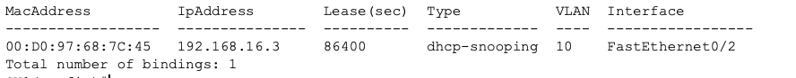

# Layer 2 Hardening: Port Security & DHCP Snooping

## Overview

This lab shows how Port Security controls which devices can use a switch port and how DHCP Snooping blocks DHCP responses from unauthorized servers.

A single-switch topology was built with one authorized user, one legitimate DHCP server, and one rogue DHCP server. Port Security protects the user port, while DHCP Snooping allows server responses only through the trusted interface.

---

## Objectives

- Limit the authorized user port to one MAC address
- Enable sticky MAC address learning
- Configure shutdown violation mode
- Enable DHCP Snooping for VLAN 10
- Trust only the legitimate DHCP server interface
- Test a Port Security violation
- Test legitimate and rogue DHCP responses

---

## Topology


- **SW0** connects all devices in VLAN 10
- **R0** provides legitimate DHCP service through `Fa0/1`
- **PC0** is the authorized user connected to `Fa0/2`
- **Rogue-DHCP** is the unauthorized DHCP server connected to `Fa0/3`

---

## Configuration

### Port Security

Port Security was configured on `Fa0/2`, which connects to the authorized user.

```cisco
interface FastEthernet0/2
 switchport mode access
 switchport access vlan 10
 switchport port-security
 switchport port-security maximum 1
 switchport port-security violation shutdown
 switchport port-security mac-address sticky
```

The port allows one MAC address and learns it automatically as a sticky secure address.

If another MAC address is detected, the port is placed into an err-disabled state.

---

### DHCP Snooping

DHCP Snooping was enabled globally and applied to VLAN 10.

```cisco
ip dhcp snooping
ip dhcp snooping vlan 10
no ip dhcp snooping information option
```

Option 82 insertion was disabled because it caused DHCP problems in Packet Tracer.

The interface connected to the legitimate DHCP server was configured as trusted.

```cisco
interface FastEthernet0/1
 ip dhcp snooping trust
```

The authorized user port and rogue DHCP server port remained untrusted by default.

---

## Verification

### Port Security

```cisco
show port-security interface FastEthernet0/2
```


The output confirmed that:

- Port Security was enabled
- The port was limited to one MAC address
- Sticky MAC learning was active
- Shutdown violation mode was configured
- The authorized MAC address was learned

---

### Port Security Violation

An unauthorized device was connected after the authorized MAC address had already been learned.


The switch detected the new MAC address and placed `Fa0/2` into an err-disabled state.

This prevented the unauthorized device from using the protected port.

---

### DHCP Snooping

```cisco
show ip dhcp snooping
```


The output confirmed that:

- DHCP Snooping was enabled for VLAN 10
- `Fa0/1` was configured as trusted
- The access ports remained untrusted

---

### DHCP Snooping Binding Table

```cisco
show ip dhcp snooping binding
```



The binding table recorded the legitimate client’s:

- MAC address
- Assigned IP address
- Lease time
- VLAN
- Switch interface

---

### Rogue DHCP Server Test

Packet Tracer simulation mode was used to compare DHCP responses from the legitimate and rogue servers.


The test confirmed that:

- The legitimate response entering through trusted interface `Fa0/1` was allowed
- The rogue response entering through untrusted interface `Fa0/3` was dropped
- PC0 received its network configuration from the legitimate DHCP server

---

## Key Takeaways

- Port Security controls which devices can use an access port
- Sticky learning automatically records the authorized MAC address
- Shutdown violation mode places the port into an err-disabled state
- DHCP Snooping allows server responses only through trusted interfaces
- Access ports remain untrusted by default
- Rogue DHCP responses received on untrusted ports are dropped
- DHCP Snooping does not shut down the rogue server port
- The binding table records legitimate DHCP assignments

---

## Environment

- Cisco Packet Tracer
- Cisco IOS
