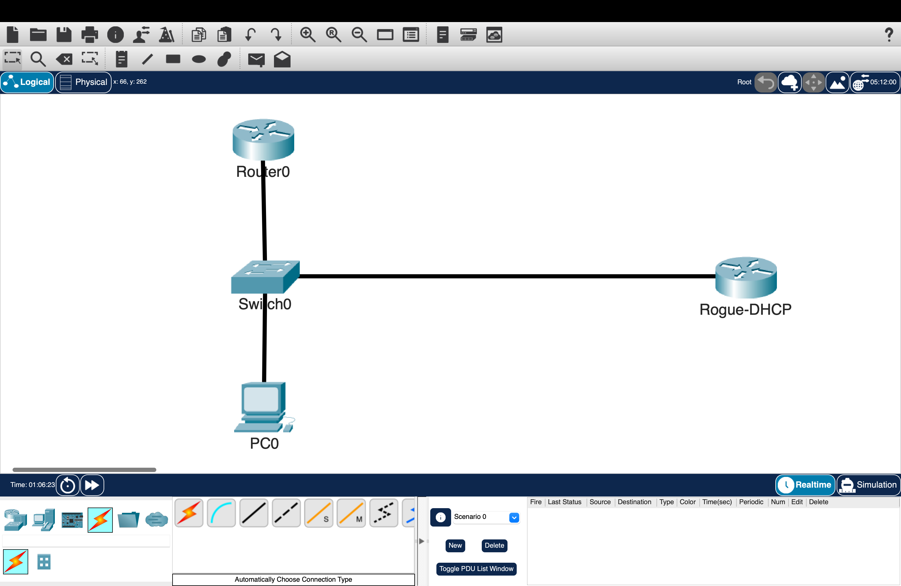
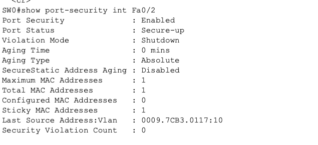
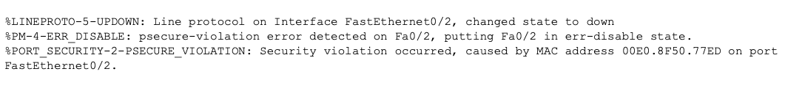
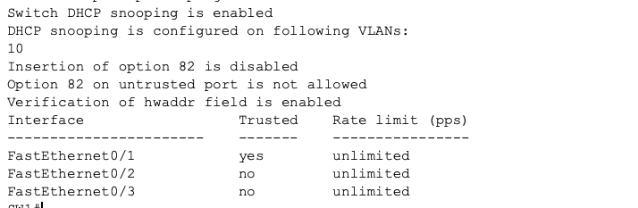
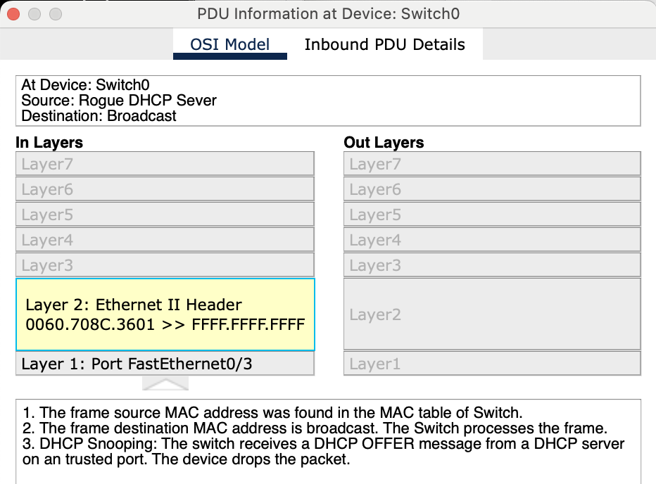

# Layer 2 Hardening: Port Security & DHCP Snooping

## Overview

This lab demonstrates Layer 2 security hardening on a Cisco IOS switch. Port Security was used to restrict unauthorized devices on an access port, while DHCP Snooping was used to block DHCP responses from a rogue DHCP server.

---

## Topology

- **SW0**: Central Layer 2 switch
- **R0**: Legitimate DHCP server connected to `Fa0/1`
- **PC0**: Authorized host connected to `Fa0/2`
- **Rogue-DHCP**: Rogue DHCP server connected to `Fa0/3`



---

## Objectives

- Configure Port Security on the authorized user port
- Limit the port to one MAC address
- Enable sticky MAC address learning
- Configure shutdown violation mode
- Enable DHCP Snooping globally
- Enable DHCP Snooping for VLAN 10
- Trust the legitimate DHCP server interface
- Block rogue DHCP responses on untrusted ports
- Verify Port Security and DHCP Snooping operation

---

## Configuration Commands

### Port Security Configuration

Port Security was configured on `Fa0/2`, which connects to the authorized user.

```cisco
interface FastEthernet0/2
 switchport mode access
 switchport access vlan 10
 switchport port-security
 switchport port-security maximum 1
 switchport port-security violation shutdown
 switchport port-security mac-address sticky
 exit
```

This configuration limits the port to one MAC address. The connected device is automatically learned as a sticky secure MAC address.

If another MAC address is detected, the interface is placed into an err-disabled state.

---

### DHCP Snooping Configuration

DHCP Snooping was enabled globally and applied to VLAN 10.

```cisco
ip dhcp snooping
ip dhcp snooping vlan 10
no ip dhcp snooping information option
```

Option 82 insertion was disabled because it caused DHCP issues in Packet Tracer.

The interface connected to the legitimate DHCP server was configured as trusted.

```cisco
interface GigabitEthernet0/1
 ip dhcp snooping trust
 exit
```

The access ports connected to the authorized user and rogue DHCP server remained untrusted by default.

---

## Verification

### Port Security Verification

Port Security was verified on `Fa0/2`.

```cisco
show port-security interface FastEthernet0/2
```



The output confirmed:

- Port Security was enabled
- The maximum MAC address count was set to one
- Sticky MAC learning was active
- Shutdown violation mode was configured
- The authorized MAC address was learned

---

### Port Security Violation Test

An unauthorized device was introduced on the protected port after the authorized MAC address had already been learned.



The switch detected the unauthorized MAC address and placed `Fa0/2` into an err-disabled state.

This confirmed that unauthorized devices could not access the network through the protected port.

---

### DHCP Snooping Verification

DHCP Snooping was verified with:

```cisco
show ip dhcp snooping
```



The output confirmed:

- DHCP Snooping was enabled globally
- DHCP Snooping was active for VLAN 10
- `Fa0/1` was configured as trusted
- Access ports remained untrusted

---

### DHCP Snooping Binding Verification

The DHCP Snooping binding table was verified with:

```cisco
show ip dhcp snooping binding
```


The output showed the legitimate client binding, including:

- MAC address
- Assigned IP address
- Lease time
- VLAN
- Switch interface

---

### Rogue DHCP Server Test

The rogue DHCP server was connected to `Fa0/3`, which remained an untrusted interface.

Packet Tracer simulation mode was used to observe the DHCP traffic.



The test confirmed:

- The legitimate DHCP response entering through trusted interface `Fa0/1` was allowed
- The rogue DHCP response entering through untrusted interface `Fa0/3` was dropped
- The authorized client received its network configuration from the legitimate DHCP server

---

## Key Takeaways

- Port Security limits which devices can use an access port
- Sticky learning automatically records the authorized MAC address
- Shutdown violation mode places the port into an err-disabled state
- DHCP Snooping must be enabled globally and for the required VLAN
- The legitimate DHCP server interface must be configured as trusted
- Access ports remain untrusted by default
- Rogue DHCP responses received on untrusted ports are dropped
- DHCP Snooping does not shut down the rogue DHCP port
- The DHCP Snooping binding table records legitimate DHCP assignments

---

## Environment

- Cisco Packet Tracer
- Cisco IOS
