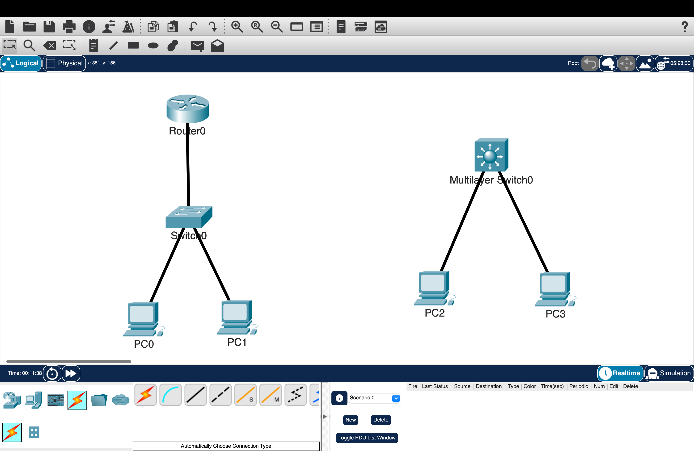

# Inter-VLAN Routing: Router-on-a-Stick and Switch Virtual Interfaces

## Overview

This lab demonstrates two methods of routing traffic between VLANs: Router-on-a-Stick using router subinterfaces and Switch Virtual Interfaces using a multilayer switch.

Each method was configured and tested separately. Both allow devices in different VLANs to communicate while preserving separate Layer 2 broadcast domains.

---

## Objectives

- Configure VLAN access ports for end devices
- Configure 802.1Q trunking between a switch and router
- Implement Router-on-a-Stick using router subinterfaces
- Match router subinterface encapsulation to the correct VLAN IDs
- Configure Switch Virtual Interfaces on a multilayer switch
- Enable Layer 3 routing on a multilayer switch
- Verify directly connected VLAN routes
- Test connectivity between devices in different VLANs

---

## Network Topology



---

## Routing Methods

| Device | Role | Interface | Method |
|---|---|---|---|
| R0 | Inter-VLAN router | `Fa0/0` subinterfaces | Router-on-a-Stick |
| SW0 | Layer 2 access switch | `Fa0/1` trunk to R0 | ROAS switching |
| MLS0 | Multilayer switch | VLAN 10 and VLAN 20 SVIs | SVI routing |

> Router-on-a-Stick and SVI routing were tested as separate implementations. R0 and MLS0 were not used as simultaneous gateways for the same VLANs.

---

## VLAN Design

| VLAN | Name | Purpose | Subnet | Gateway |
|---|---|---|---|---|
| 10 | Sales | Sales department | `192.168.10.0/24` | `192.168.10.1` |
| 20 | Engineering | Engineering department | `192.168.20.0/24` | `192.168.20.1` |
| 99 | Management | Switch management | `192.168.99.0/24` | `192.168.99.1` |
| 999 | Native | Unused native VLAN | N/A | N/A |

---

## Device Addressing

| Device | Interface | IP Address | Subnet Mask | VLAN | Default Gateway |
|---|---|---|---|---|---|
| PC0 | FastEthernet0 | `192.168.10.10` | `255.255.255.0` | 10 | `192.168.10.1` |
| PC1 | FastEthernet0 | `192.168.20.10` | `255.255.255.0` | 20 | `192.168.20.1` |
| R0 | FastEthernet0/0.10 | `192.168.10.1` | `255.255.255.0` | 10 | N/A |
| R0 | FastEthernet0/0.20 | `192.168.20.1` | `255.255.255.0` | 20 | N/A |
| MLS0 | VLAN 10 | `192.168.10.1` | `255.255.255.0` | 10 | N/A |
| MLS0 | VLAN 20 | `192.168.20.1` | `255.255.255.0` | 20 | N/A |

---

## Configuration

### Router-on-a-Stick

#### Switch Trunk and Access Ports

SW0 was configured with access ports for the end devices and an 802.1Q trunk toward R0.

```cisco
interface FastEthernet0/1
 switchport mode trunk
 switchport trunk native vlan 999
 switchport trunk allowed vlan 10,20,99,999
 exit

interface FastEthernet0/2
 switchport mode access
 switchport access vlan 10
 exit

interface FastEthernet0/3
 switchport mode access
 switchport access vlan 20
 exit
```

#### Router Subinterfaces

Subinterfaces were created on R0 for VLANs 10 and 20. Each subinterface was assigned the default-gateway address for its VLAN.

```cisco
interface FastEthernet0/0
 no shutdown
 exit

interface FastEthernet0/0.10
 encapsulation dot1Q 10
 ip address 192.168.10.1 255.255.255.0
 exit

interface FastEthernet0/0.20
 encapsulation dot1Q 20
 ip address 192.168.20.1 255.255.255.0
 exit
```

---

### Switch Virtual Interfaces

MLS0 was configured to route between VLANs using Switch Virtual Interfaces.

```cisco
ip routing

interface vlan 10
 ip address 192.168.10.1 255.255.255.0
 no shutdown
 exit

interface vlan 20
 ip address 192.168.20.1 255.255.255.0
 no shutdown
 exit
```

The VLAN interfaces provided the default gateways for devices in VLANs 10 and 20.

---

## Verification

### Routing Table Verification

The routing table was checked on R0 and MLS0.

```cisco
show ip route
```


The output confirmed:

- `192.168.10.0/24` appeared as a directly connected network
- `192.168.20.0/24` appeared as a directly connected network
- The configured subinterfaces or SVIs were available for Layer 3 forwarding

---

### Trunk Verification

The trunk between SW0 and R0 was verified.

```cisco
show interfaces trunk
```


The output confirmed:

- `FastEthernet0/1` was operating as a trunk
- VLAN 999 was configured as the native VLAN
- VLANs 10, 20, 99, and 999 were allowed across the trunk

---

### SVI Verification

The status of the VLAN interfaces on MLS0 was verified.

```cisco
show ip interface brief
```


The output confirmed:

- VLAN 10 had the correct gateway address
- VLAN 20 had the correct gateway address
- Both SVIs were operational
- IP routing was enabled on the multilayer switch

---

### Connectivity Testing

PC0 tested connectivity to PC1 across the VLAN boundary.

```text
PC0> ping 192.168.20.10
```


The test confirmed:

- PC0 could reach PC1
- Traffic was routed between VLAN 10 and VLAN 20
- The configured default gateways forwarded traffic between the two subnets

---

## Results

Router-on-a-Stick successfully routed traffic between VLANs using router subinterfaces over a single 802.1Q trunk.

The multilayer switch also successfully routed traffic between VLANs using Switch Virtual Interfaces and internal Layer 3 switching.

Both implementations provided communication between the VLANs while maintaining separate Layer 2 broadcast domains.

---

## Key Takeaways

- Devices in different VLANs require a Layer 3 gateway to communicate
- Router-on-a-Stick uses router subinterfaces over a single trunk link
- Each router subinterface must use the correct 802.1Q VLAN ID
- SVIs provide Layer 3 gateways directly on a multilayer switch
- IP routing must be enabled for a multilayer switch to route between VLANs
- End devices must use the correct VLAN gateway address
- Router-on-a-Stick and SVI routing solve the same problem using different designs
- SVI routing avoids sending all inter-VLAN traffic through one external router link

---

## Environment

- Cisco Packet Tracer
- Cisco IOS
