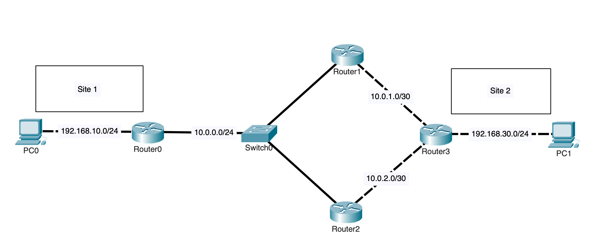
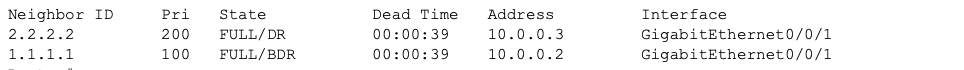
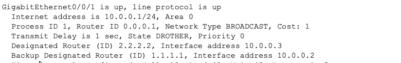
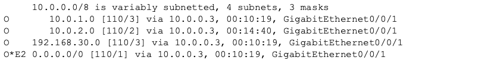
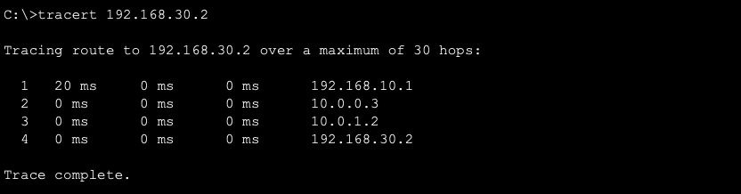
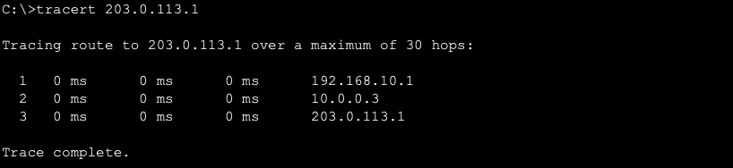
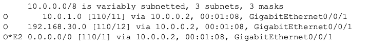
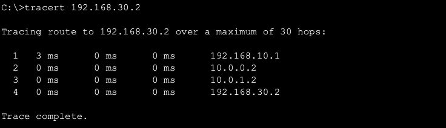
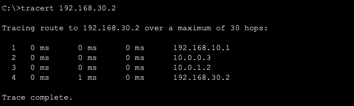

# Single-Area OSPFv2

## Overview

This lab shows how OSPF automatically discovers neighboring routers, learns routes to other networks, chooses the lowest-cost path, and updates the route when a link fails.

A four-router topology connects two LANs. R2 provides the preferred path, while R1 provides a higher-cost backup path. R0, R1, and R2 also share an Ethernet network to demonstrate OSPF neighbor formation and DR and BDR election.

---

## Objectives

- Configure single-area OSPFv2
- Assign OSPF router IDs
- Form OSPF neighbor relationships
- Demonstrate DR and BDR election
- Configure passive interfaces
- Use OSPF cost to control path selection
- Advertise a default route through OSPF
- Verify OSPF routes and traffic paths
- Test convergence after a link failure
- Confirm the preferred path returns after recovery

---

## Topology



R0 connects the Site 1 LAN, and R3 connects the Site 2 LAN.

R2 provides the preferred path between R0 and R3. R1 provides a higher-cost backup path if the R2–R3 link fails.

R0, R1, and R2 connect to the same Ethernet network through SW0. This shared network is used to demonstrate OSPF neighbor formation and DR and BDR election.

R3 acts as the network edge and advertises a default route to the other routers. A loopback interface on R3 provides a reachable address for testing the default route.

---

## Network Design

### Site Networks

| Network | Subnet | Router Address | End Device |
|---|---|---|---|
| Site 1 LAN | `192.168.10.0/24` | R0: `192.168.10.1` | PC0: `192.168.10.2` |
| Site 2 LAN | `192.168.30.0/24` | R3: `192.168.30.1` | PC1: `192.168.30.2` |
| Simulated External Network | `203.0.113.1/32` | R3 Loopback0: `203.0.113.1` | None |

PC0 uses `192.168.10.1` as its default gateway. PC1 uses `192.168.30.1`.

### Router Links

| Link | Subnet | Router Addresses |
|---|---|---|
| Shared OSPF Network | `10.0.0.0/24` | R0: `10.0.0.1`, R1: `10.0.0.2`, R2: `10.0.0.3` |
| Backup Link — R1 to R3 | `10.0.1.0/30` | R1: `10.0.1.1`, R3: `10.0.1.2` |
| Preferred Link — R2 to R3 | `10.0.2.0/30` | R2: `10.0.2.1`, R3: `10.0.2.2` |

---

## OSPF Design

All internal networks are placed in OSPF area 0.

| Router | Router ID | Shared-Network Role |
|---|---|---|
| R0 | `0.0.0.1` | DROTHER |
| R1 | `1.1.1.1` | BDR |
| R2 | `2.2.2.2` | DR |
| R3 | `3.3.3.3` | Not connected to shared network |

R2 becomes the DR, and R1 becomes the BDR.

R0 uses an OSPF priority of `0`, preventing it from becoming the DR or BDR.

The R1–R3 link uses an OSPF cost of `10`. The R2–R3 link keeps its lower default cost, making R2 the preferred path and R1 the backup path.

---

## Configuration

### R0 OSPF Configuration

R0 advertises the Site 1 LAN and the shared OSPF network.

The interface facing PC0 is passive because it connects to an end device instead of another OSPF router.

```cisco
interface GigabitEthernet0/0/0
 ip address 192.168.10.1 255.255.255.0
 no shutdown

interface GigabitEthernet0/0/1
 ip address 10.0.0.1 255.255.255.0
 ip ospf priority 0
 no shutdown

router ospf 1
 router-id 0.0.0.1
 passive-interface GigabitEthernet0/0/0
 network 192.168.10.0 0.0.0.255 area 0
 network 10.0.0.0 0.0.0.255 area 0
```

---

### R1 OSPF Configuration

R1 participates in the shared OSPF network and provides the higher-cost backup path to R3.

```cisco
interface GigabitEthernet0/0/0
 ip address 10.0.0.2 255.255.255.0
 ip ospf priority 100
 no shutdown

interface GigabitEthernet0/0/1
 ip address 10.0.1.1 255.255.255.252
 ip ospf cost 10
 no shutdown

router ospf 1
 router-id 1.1.1.1
 network 10.0.0.0 0.0.0.255 area 0
 network 10.0.1.0 0.0.0.3 area 0
```

---

### R2 OSPF Configuration

R2 has the highest priority on the shared network and becomes the DR.

Its link to R3 keeps the lower default OSPF cost, making it the preferred path.

```cisco
interface GigabitEthernet0/0/0
 ip address 10.0.0.3 255.255.255.0
 ip ospf priority 200
 no shutdown

interface GigabitEthernet0/0/1
 ip address 10.0.2.1 255.255.255.252
 no shutdown

router ospf 1
 router-id 2.2.2.2
 network 10.0.0.0 0.0.0.255 area 0
 network 10.0.2.0 0.0.0.3 area 0
```

---

### R3 OSPF Configuration

R3 connects to both paths and advertises the Site 2 LAN.

The interface facing PC1 is passive because it connects to an end device instead of another OSPF router.

The R3 interface toward R1 also uses a cost of `10`, making the R1 path less preferred in both directions.

```cisco
interface GigabitEthernet0/0
 ip address 10.0.1.2 255.255.255.252
 ip ospf cost 10
 no shutdown

interface GigabitEthernet0/1
 ip address 10.0.2.2 255.255.255.252
 no shutdown

interface GigabitEthernet0/2
 ip address 192.168.30.1 255.255.255.0
 no shutdown

interface Loopback0
 ip address 203.0.113.1 255.255.255.255
```

R3 uses a static default route to simulate an external connection.

```cisco
ip route 0.0.0.0 0.0.0.0 Null0
```

R3 advertises that default route to the other OSPF routers.

```cisco
router ospf 1
 router-id 3.3.3.3
 passive-interface GigabitEthernet0/2
 network 10.0.1.0 0.0.0.3 area 0
 network 10.0.2.0 0.0.0.3 area 0
 network 192.168.30.0 0.0.0.255 area 0
 default-information originate
```

The `203.0.113.1/32` loopback network is not advertised directly through OSPF.

The other routers reach it using the default route advertised by R3.

---

## Verification

### OSPF Neighbor Formation

The OSPF neighbors were checked on R0.

```cisco
show ip ospf neighbor
```



The output confirmed that:

- R0 formed neighbor relationships with R1 and R2
- R2 was the DR
- R1 was the BDR
- Both neighbors reached the FULL state

---

### DR and BDR Election

The shared OSPF interface was checked on R0.

```cisco
show ip ospf interface GigabitEthernet0/0/1
```



The output confirmed that:

- R2 became the DR
- R1 became the BDR
- R0 remained a DROTHER
- OSPF priority controlled the election

---

### OSPF Routing Table

The OSPF routes were checked on R0.

```cisco
show ip route ospf
```



The output confirmed that R0 learned:

- The Site 2 LAN through OSPF
- The networks between R1, R2, and R3
- A default route advertised by R3

The route to the Site 2 LAN used the lower-cost path through R2.

---

### Primary Path Testing

PC0 traced the path to PC1 while all links were working.

```text
PC0> tracert 192.168.30.2
```



The trace confirmed that traffic used the preferred path:

```text
PC0 → R0 → R2 → R3 → PC1
```

OSPF selected this path because it had a lower total cost than the path through R1.

---

### Default Route Testing

PC0 traced the path to the simulated external address on R3.

```text
PC0> tracert 203.0.113.1
```



The trace confirmed that traffic used the OSPF default route advertised by R3.

R0 did not have a specific route to `203.0.113.1`, so it used the default route.

---

### OSPF Convergence

The preferred R2–R3 link was disabled to simulate a failure.

The OSPF routing table was checked again on R0.

```cisco
show ip route ospf
```



The output confirmed that OSPF removed the failed path and installed the available route through R1.

No manual route changes were required.

---

### Backup Path Testing

PC0 traced the path to PC1 while the R2–R3 link was down.

```text
PC0> tracert 192.168.30.2
```



The trace confirmed that traffic used the backup path:

```text
PC0 → R0 → R1 → R3 → PC1
```

PC0 and PC1 remained connected even though the preferred link was unavailable.

---

### Preferred Path Recovery

The R2–R3 link was restored.

PC0 traced the path to PC1 again after OSPF reconverged.

```text
PC0> tracert 192.168.30.2
```



The trace confirmed that traffic returned to the lower-cost path through R2.

---

## Key Takeaways

- OSPF automatically discovers neighboring routers
- OSPF learns routes to networks connected to other routers
- Router IDs uniquely identify OSPF routers
- OSPF priority controls DR and BDR election
- R0 cannot become the DR or BDR because its priority is `0`
- Passive interfaces advertise networks without forming unnecessary neighbors
- OSPF cost determines the preferred path
- The lower-cost R2 path is preferred during normal operation
- The higher-cost R1 path remains available as a backup
- OSPF automatically changes routes when the preferred link fails
- `default-information originate` advertises a default route
- Routing tables show which OSPF routes are active
- Traceroute shows the path traffic takes

---

## Environment

- Cisco Packet Tracer
- Cisco IOS
- OSPFv2
- Single OSPF area: Area 0
