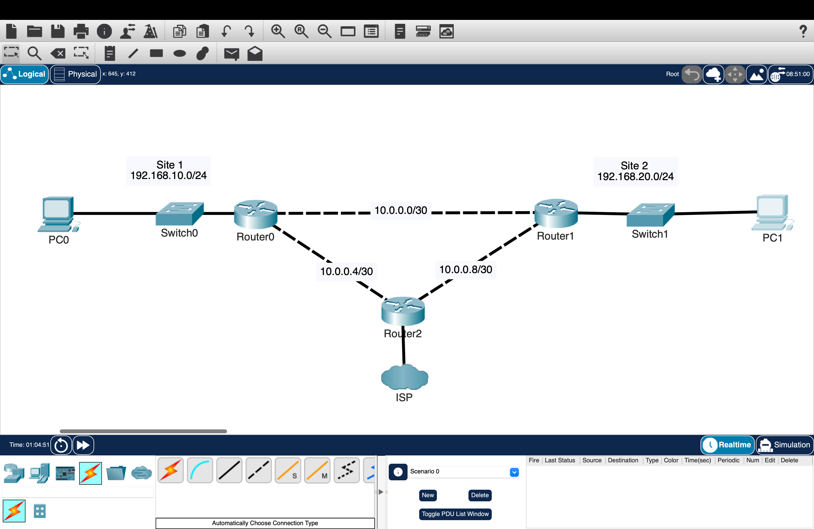

# Static, Default & Floating Routing

## Overview

This lab shows how static routes connect different networks, how default routes handle unknown destinations, and how floating static routes provide a backup path if the main route fails.

A three-router topology was built with a direct path between two LANs and an alternate path through a third router. The alternate path provides backup connectivity if the direct connection fails.

---

## Objectives

- Configure static routes between IPv4 networks
- Use a default route for destinations not explicitly listed in the routing table
- Configure floating static routes for backup connectivity
- Control route preference using administrative distance
- Demonstrate longest-prefix match
- Verify routing-table entries and packet paths
- Test connectivity during normal operation
- Simulate a primary-link failure and verify automatic failover
- Restore the primary connection and verify path recovery

---

## Topology



R0 connects the Site 1 LAN, while R1 connects the Site 2 LAN. The direct link between R0 and R1 is the preferred path.

R2 provides an alternate path between the two routers and hosts a loopback network used for longest-prefix match testing.

---

## Network Design

### LAN Networks

| Network | Subnet | Gateway |
|---|---|---|
| Site 1 LAN | `192.168.10.0/24` | `192.168.10.1` |
| Site 2 LAN | `192.168.20.0/24` | `192.168.20.1` |

### Router Links

| Connection | Subnet |
|---|---|
| R0–R1 | `10.0.0.0/30` |
| R0–R2 | `10.0.0.4/30` |
| R1–R2 | `10.0.0.8/30` |

### Router Addressing

| Router | Interface Connection | IP Address |
|---|---|---|
| R0 | Site 1 LAN | `192.168.10.1/24` |
| R0 | R0–R1 | `10.0.0.1/30` |
| R0 | R0–R2 | `10.0.0.5/30` |
| R1 | Site 2 LAN | `192.168.20.1/24` |
| R1 | R0–R1 | `10.0.0.2/30` |
| R1 | R1–R2 | `10.0.0.9/30` |
| R2 | R0–R2 | `10.0.0.6/30` |
| R2 | R1–R2 | `10.0.0.10/30` |
| R2 | Loopback0 | `198.51.100.1/24` |

### Endpoint Addressing

| Device | IP Address | Default Gateway |
|---|---|---|
| PC0 | `192.168.10.10/24` | `192.168.10.1` |
| PC1 | `192.168.20.10/24` | `192.168.20.1` |

---

## Configuration

### R0 Routing

R0 uses a default route through R1 as its preferred path.

A second default route through R2 uses a higher administrative distance, making it a floating static route. This route becomes active only when the preferred route through R1 is unavailable.

```cisco
ip route 0.0.0.0 0.0.0.0 10.0.0.2
ip route 0.0.0.0 0.0.0.0 10.0.0.6 10
```

R0 also uses a more-specific route to reach the loopback network on R2.

```cisco
ip route 198.51.100.0 255.255.255.0 10.0.0.6
```

The route to `198.51.100.0/24` is selected instead of the default route because it is the longer and more-specific prefix.

---

### R1 Routing

R1 uses the direct connection to R0 as its preferred route to the Site 1 LAN.

A second route through R2 uses a higher administrative distance and provides a backup path.

```cisco
ip route 192.168.10.0 255.255.255.0 10.0.0.1
ip route 192.168.10.0 255.255.255.0 10.0.0.10 10
```

R1 reaches the loopback network directly through R2.

```cisco
ip route 198.51.100.0 255.255.255.0 10.0.0.10
```

---

### R2 Routing

R2 provides the alternate path between the two LANs.

```cisco
ip route 192.168.10.0 255.255.255.0 10.0.0.5
ip route 192.168.20.0 255.255.255.0 10.0.0.9
```

A loopback interface was configured to create a separate network for longest-prefix match testing.

```cisco
interface Loopback0
 ip address 198.51.100.1 255.255.255.0
```

---

## Verification

### Interface Status

Router interfaces were checked before testing the configured routes.

```cisco
show ip interface brief
```


The output confirmed that the required router interfaces were operational and using the correct IP addresses.

---

### R0 Normal Routing Table

The routing table was checked on R0 while all links were operational.

```cisco
show ip route
```


The output confirmed that:

- The preferred default route through R1 was active
- The floating default route through R2 was not active
- The more-specific route to `198.51.100.0/24` through R2 was active

---

### R1 Normal Routing Table

The routing table was also checked on R1.

```cisco
show ip route
```


The output confirmed that the preferred route to the Site 1 LAN used the direct connection to R0.

The floating static route through R2 remained inactive while the preferred route was available.

---

### Primary Path Testing

PC0 traced the path to PC1 during normal operation.

```text
PC0> tracert 192.168.20.10
```


The trace confirmed that traffic used the direct R0–R1 link as the preferred path between the two LANs.

---

### Longest-Prefix Match Testing

PC0 traced the path to the loopback network on R2.

```text
PC0> tracert 198.51.100.1
```


R0 had two matching routes:

- `0.0.0.0/0` through R1
- `198.51.100.0/24` through R2

The `/24` route was selected because it matched the destination more specifically than the `/0` default route.

---

### R0 Floating Default Route

The direct link between R0 and R1 was disabled to simulate a primary-path failure.

The routing table was then checked again on R0.

```cisco
show ip route
```


The output confirmed that the preferred default route through R1 was removed and the floating default route through R2 became active.

---

### R1 Floating Static Route

The route to the Site 1 LAN was checked on R1 after the direct link failed.

```cisco
show ip route 192.168.10.0
```


The output confirmed that the preferred route through R0 was removed and the floating static route through R2 became active.

---

### Backup Path Testing

PC0 traced the path to PC1 while the direct R0–R1 link was down.

```text
PC0> tracert 192.168.20.10
```


The trace confirmed that traffic was redirected through R2 and that connectivity between the two LANs remained available.

---

### Primary Path Recovery

The direct link between R0 and R1 was restored.

The routing tables were checked again.

```cisco
show ip route
```


The output confirmed that:

- The preferred routes returned
- The floating static routes became inactive
- Traffic returned to the direct path between R0 and R1

---

## Key Takeaways

- Static routes manually define paths to remote networks
- A default route is used when no more-specific route exists
- Longest-prefix match selects the most-specific matching route
- Administrative distance determines which route is preferred when multiple routes reach the same destination
- Floating static routes provide backup connectivity by using a higher administrative distance
- Floating routes become active when the preferred route is removed
- Both forward and return routes are required for successful communication
- Routing tables show which routes are active
- Traceroute shows the path traffic takes through the network

---

## Environment

- Cisco Packet Tracer
- Cisco IOS
