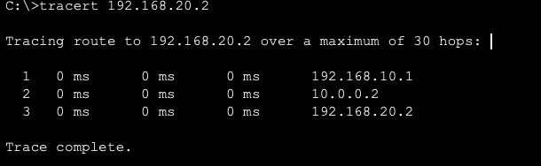
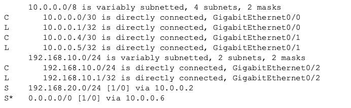

# Static, Default & Floating Routing

## Overview

This lab demonstrates how static routes manually direct traffic between remote networks, how default routes handle destinations without a more-specific route, and how floating static routes provide backup connectivity after a primary path fails.

A three-router topology was built with a direct connection between the Branch and Headquarters routers and an alternate path through a backup router. Administrative distance controls which routes are preferred, while longest-prefix match determines when a more-specific route overrides the default path.

---

## Objectives

- Configure static routes between remote IPv4 networks
- Use a default route for destinations not explicitly listed in the routing table
- Configure floating static routes as backup paths
- Control route preference using administrative distance
- Demonstrate longest-prefix match
- Verify routing-table entries and packet paths
- Test connectivity during normal operation
- Simulate a primary-link failure and verify automatic failover
- Restore the primary connection and verify path recovery

---

## Topology


### Device Roles

- **R1-BRANCH** provides routing for the Branch LAN
- **R2-HQ** provides routing for the Headquarters LAN
- **R3-BACKUP** provides the alternate route between Branch and Headquarters
- **SW1-BRANCH** connects the Branch endpoint to R1-BRANCH
- **SW2-HQ** connects the Headquarters endpoint to R2-HQ
- **SW3-SERVER** connects the external server to R3-BACKUP
- **PC-BRANCH** represents a Branch user
- **PC-HQ** represents a Headquarters user
- **SERVER0** represents an external server network

The direct R1-BRANCH to R2-HQ connection is the preferred path. R3-BACKUP provides an alternate path if the direct connection becomes unavailable.

---

## Network Design

### LAN Networks

| Location | Network | Gateway |
|---|---|---|
| Branch | `192.168.10.0/24` | `192.168.10.1` |
| Headquarters | `192.168.20.0/24` | `192.168.20.1` |
| External Server | `198.51.100.0/24` | `198.51.100.1` |

### Router Connections

| Connection | Network | First Address | Second Address |
|---|---|---|---|
| R1-BRANCH to R2-HQ | `10.0.12.0/30` | R1: `10.0.12.1` | R2: `10.0.12.2` |
| R1-BRANCH to R3-BACKUP | `10.0.13.0/30` | R1: `10.0.13.1` | R3: `10.0.13.2` |
| R2-HQ to R3-BACKUP | `10.0.23.0/30` | R2: `10.0.23.1` | R3: `10.0.23.2` |

### Endpoint Addressing

| Device | IP Address | Default Gateway |
|---|---|---|
| PC-BRANCH | `192.168.10.10/24` | `192.168.10.1` |
| PC-HQ | `192.168.20.10/24` | `192.168.20.1` |
| SERVER0 | `198.51.100.10/24` | `198.51.100.1` |

---

## Configuration

### R1-BRANCH Routing

R1-BRANCH was configured with a primary default route through the direct Headquarters connection.

A floating default route with a higher administrative distance was configured through R3-BACKUP. This route remains inactive while the primary default route is available.

A more-specific route directs traffic for the external server network through R3-BACKUP.

```cisco
ip route 0.0.0.0 0.0.0.0 10.0.12.2
ip route 0.0.0.0 0.0.0.0 10.0.13.2 10
ip route 198.51.100.0 255.255.255.0 10.0.13.2
```

The `198.51.100.0/24` route is more specific than the default route, so server traffic uses R3-BACKUP even while the primary default route points toward R2-HQ.

---

### R2-HQ Routing

R2-HQ was configured with a primary route to the Branch LAN through the direct connection to R1-BRANCH.

A floating static route provides an alternate return path through R3-BACKUP. R2-HQ also uses R3-BACKUP to reach the external server network.

```cisco
ip route 192.168.10.0 255.255.255.0 10.0.12.1
ip route 192.168.10.0 255.255.255.0 10.0.23.2 10
ip route 198.51.100.0 255.255.255.0 10.0.23.2
```

---

### R3-BACKUP Routing

R3-BACKUP was configured with routes to both internal LANs.

```cisco
ip route 192.168.10.0 255.255.255.0 10.0.13.1
ip route 192.168.20.0 255.255.255.0 10.0.23.1
```

These routes allow R3-BACKUP to forward traffic between Branch and Headquarters when the direct connection fails.

---

## Verification

### Static Route Configuration

The configured static routes were verified on R1-BRANCH and R2-HQ.

```cisco
show running-config | include ip route
```


The output confirmed that:

- Primary routes used the default administrative distance
- Backup routes used a higher administrative distance
- R1-BRANCH contained both a primary and floating default route
- R2-HQ contained both a primary and floating route to the Branch LAN
- The external server network had a separate, more-specific route

---

### Normal Routing Table

The routing table was verified on R1-BRANCH while all connections were operational.

```cisco
show ip route
```


The output confirmed that:

- The primary default route through R2-HQ was installed
- The more-specific server route through R3-BACKUP was installed
- The floating default route was not installed while the preferred route remained available
- Directly connected LAN and transit networks appeared correctly

---

### Primary-Path Testing

PC-BRANCH traced the path to PC-HQ.

```text
PC-BRANCH> tracert 192.168.20.10
```



The trace confirmed that Headquarters traffic followed the direct path from R1-BRANCH to R2-HQ.

---

### Longest-Prefix Match Testing

PC-BRANCH traced the path to SERVER0.

```text
PC-BRANCH> tracert 198.51.100.10
```


The trace confirmed that server traffic followed the specific `198.51.100.0/24` route through R3-BACKUP instead of following the default route through R2-HQ.

This demonstrated that the router selects the longest matching prefix before considering administrative distance.

---

### Floating Route Activation

The direct connection between R1-BRANCH and R2-HQ was disabled to simulate a primary-path failure.

The routing table was then verified again on R1-BRANCH.

```cisco
show ip route
```


The output confirmed that:

- The primary default route was removed
- The floating default route through R3-BACKUP became active
- The route with the higher administrative distance was installed only after the preferred route became unavailable

---

### Backup Return Route

The route to the Branch LAN was verified on R2-HQ after the direct connection failed.

```cisco
show ip route 192.168.10.0
```


The output confirmed that R2-HQ replaced its primary Branch route with the floating route through R3-BACKUP.

This provided a valid return path for traffic traveling between Headquarters and Branch.

---

### Backup-Path Testing

PC-BRANCH traced the path to PC-HQ after the primary connection failed.

```text
PC-BRANCH> tracert 192.168.20.10
```


The trace confirmed that traffic was redirected through R3-BACKUP and that connectivity continued without a dynamic routing protocol.

---

### Primary-Path Recovery

The direct connection between R1-BRANCH and R2-HQ was restored.

```cisco
show ip route
```



The output confirmed that:

- The preferred routes returned to the routing tables
- The floating routes were removed from active use
- Branch-to-Headquarters traffic returned to the direct path
- The network recovered its original routing behavior

---

## Key Takeaways

- Static routes manually define how routers reach remote networks
- Default routes handle destinations without a more-specific routing-table entry
- Longest-prefix match determines which destination route is selected
- Administrative distance determines which route source is preferred when routes have the same prefix
- Floating static routes use a higher administrative distance to provide backup connectivity
- Backup routes enter the routing table only when the preferred route becomes unavailable
- Both forward and return routes are required for successful communication
- Routing-table verification and path tracing confirm the actual forwarding behavior
- Static routing can provide failover without using a dynamic routing protocol

---

## Environment

- Cisco Packet Tracer
- Cisco IOS
