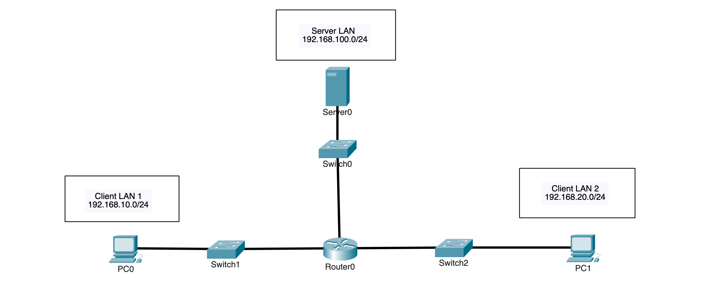
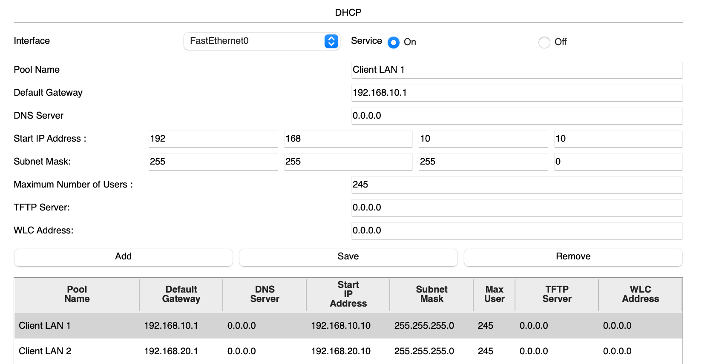
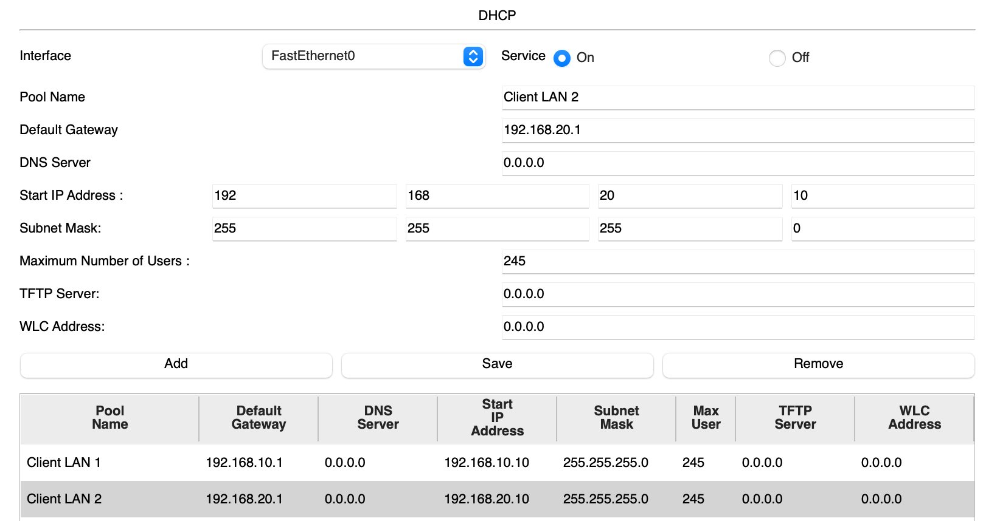
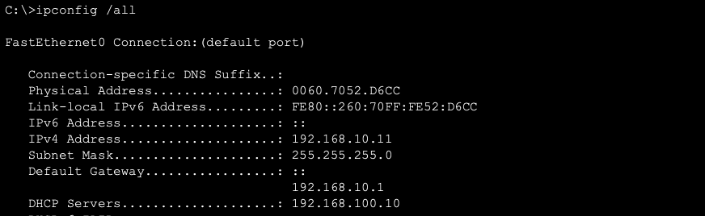
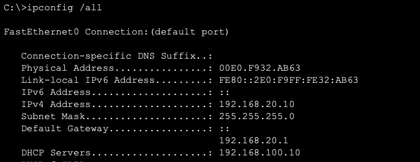
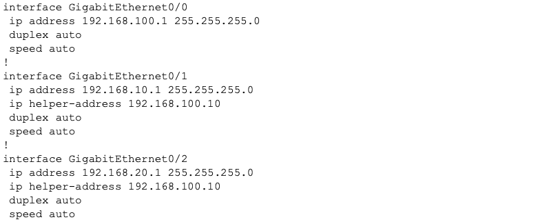
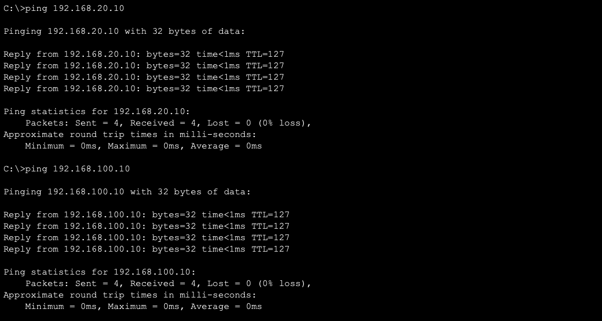
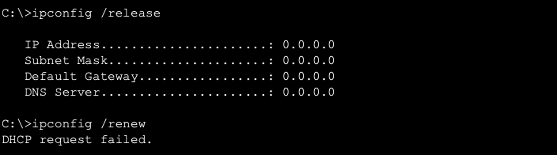
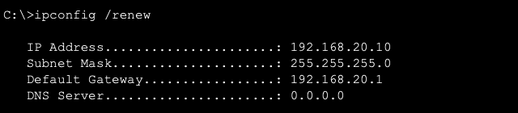

# DHCP Server & Relay

## Overview

This lab shows how a centralized DHCP server assigns IP addresses to clients on different networks and how DHCP relay forwards requests across a router.

A three-LAN topology was built with the DHCP server on one network and two client networks connected to separate R0 interfaces. R0 forwards DHCP requests from both client networks to Server0, which assigns addresses from the correct DHCP pool.

---

## Objectives

- Configure a centralized DHCP server
- Create separate DHCP pools for different client networks
- Configure DHCP relay on router interfaces
- Automatically assign client IP addresses
- Provide the correct subnet mask and default gateway
- Verify DHCP leases on both client networks
- Test connectivity between the clients and server
- Test DHCP relay failure and recovery

---

## Topology



Server0 connects to the Server LAN through SW0.

PC0 connects to Client LAN 1 through SW1, and PC1 connects to Client LAN 2 through SW2.

R0 connects all three networks. Because Server0 is on a different network from the clients, R0 must relay their DHCP requests to the server.

---

## Network Design

### Networks

| Network | Subnet | Router Address | Connected Device |
| :--- | :--- | :--- | :--- |
| Server LAN | `192.168.100.0/24` | R0: `192.168.100.1` | Server0: `192.168.100.10` |
| Client LAN 1 | `192.168.10.0/24` | R0: `192.168.10.1` | PC0: DHCP |
| Client LAN 2 | `192.168.20.0/24` | R0: `192.168.20.1` | PC1: DHCP |

Server0 uses `192.168.100.1` as its default gateway.

PC0 and PC1 receive their IP address, subnet mask, and default gateway automatically from Server0.

### DHCP Pools

| Pool | Network | Starting Address | Default Gateway |
| :--- | :--- | :--- | :--- |
| Client LAN 1 | `192.168.10.0/24` | `192.168.10.10` | `192.168.10.1` |
| Client LAN 2 | `192.168.20.0/24` | `192.168.20.10` | `192.168.20.1` |

The pools begin at `.10` so the lower addresses remain available for routers and other devices that require static addresses.

---

## Configuration

### R0 Interface Configuration

R0 connects the server network and both client networks.

```cisco
interface GigabitEthernet0/0
 ip address 192.168.100.1 255.255.255.0
 no shutdown

interface GigabitEthernet0/1
 ip address 192.168.10.1 255.255.255.0
 ip helper-address 192.168.100.10
 no shutdown

interface GigabitEthernet0/2
 ip address 192.168.20.1 255.255.255.0
 ip helper-address 192.168.100.10
 no shutdown
```

The `ip helper-address` command forwards DHCP messages from each client network to Server0.

The Server LAN interface does not require DHCP relay because Server0 is directly connected to that network.

---

### Server0 Addressing

Server0 uses a static address so R0 always knows where to forward DHCP requests.

```text
IP Address:      192.168.100.10
Subnet Mask:     255.255.255.0
Default Gateway: 192.168.100.1
```

---

### Client LAN 1 DHCP Pool

The first DHCP pool provides addresses to clients on `192.168.10.0/24`.

```text
Pool Name:        Client LAN 1
Default Gateway:  192.168.10.1
Starting Address: 192.168.10.10
Subnet Mask:      255.255.255.0
Maximum Users:    245
```

---

### Client LAN 2 DHCP Pool

The second DHCP pool provides addresses to clients on `192.168.20.0/24`.

```text
Pool Name:        Client LAN 2
Default Gateway:  192.168.20.1
Starting Address: 192.168.20.10
Subnet Mask:      255.255.255.0
Maximum Users:    245
```

When R0 relays a DHCP request, it identifies the client network where the request was received. Server0 uses that information to select the correct DHCP pool.

---

## Verification

### Client LAN 1 DHCP Pool

The Client LAN 1 pool was checked on Server0.



The pool was configured with:

- `192.168.10.10` as the starting address
- `255.255.255.0` as the subnet mask
- `192.168.10.1` as the default gateway
- A maximum of 245 users

---

### Client LAN 2 DHCP Pool

The Client LAN 2 pool was checked on Server0.



The pool was configured with:

- `192.168.20.10` as the starting address
- `255.255.255.0` as the subnet mask
- `192.168.20.1` as the default gateway
- A maximum of 245 users

The DHCP service was enabled, and both client pools were present on Server0.

---

### Client LAN 1 Address Assignment

PC0 was configured to obtain its addressing through DHCP.

```text
PC0> ipconfig /all
```



The output confirmed that PC0 received:

- An address from `192.168.10.0/24`
- A `/24` subnet mask
- `192.168.10.1` as its default gateway
- Its lease from Server0 at `192.168.100.10`

---

### Client LAN 2 Address Assignment

PC1 was configured to obtain its addressing through DHCP.

```text
PC1> ipconfig /all
```



The output confirmed that PC1 received:

- An address from `192.168.20.0/24`
- A `/24` subnet mask
- `192.168.20.1` as its default gateway
- Its lease from Server0 at `192.168.100.10`

---

### DHCP Relay Configuration

The R0 configuration was checked to verify that both client-facing interfaces forwarded DHCP messages to Server0.

```cisco
show running-config
```



The output confirmed that:

- `GigabitEthernet0/1` forwarded DHCP messages from Client LAN 1
- `GigabitEthernet0/2` forwarded DHCP messages from Client LAN 2
- Both interfaces forwarded requests to `192.168.100.10`
- `GigabitEthernet0/0` did not require DHCP relay

---

### Connectivity Testing

PC0 tested connectivity to PC1 and Server0.

```text
PC0> ping 192.168.20.10
PC0> ping 192.168.100.10
```



The successful replies confirmed that:

- Both clients received usable DHCP addresses
- Each client received the correct default gateway
- R0 routed traffic between all three networks
- The clients could reach each other
- The clients could reach the centralized server

---

### DHCP Relay Failure

The DHCP relay configuration was temporarily removed from `GigabitEthernet0/2`, which connects to Client LAN 2.

PC1 released its existing address and attempted to obtain a new lease.

```text
PC1> ipconfig /release
PC1> ipconfig /renew
```



PC1 could not obtain a new DHCP lease because its broadcast request could not reach Server0 without DHCP relay.

PC0 remained operational because relay was still configured on `GigabitEthernet0/1`.

---

### DHCP Relay Recovery

The DHCP relay configuration was restored on `GigabitEthernet0/2`.

PC1 requested an address again.

```text
PC1> ipconfig /renew
```



PC1 received an address from the correct DHCP pool after relay was restored.

The successful lease and connectivity tests confirmed that DHCP service had recovered.

---

## Key Takeaways

- DHCP automatically provides IP configuration to clients
- Separate client networks require separate DHCP pools
- DHCP clients begin by sending broadcast messages
- Routers do not normally forward broadcasts between networks
- DHCP relay forwards DHCP messages to a server on another network
- `ip helper-address` identifies the destination DHCP server
- Relay is configured on the interface where the client broadcast enters the router
- The relay identifies which client network sent the request
- Server0 uses that information to select the correct DHCP pool
- Server0 requires a static address so the relay destination does not change
- Removing relay prevents clients on that network from obtaining new leases
- Restoring relay restores automatic address assignment

---

## Environment

- Cisco Packet Tracer
- Cisco IOS
