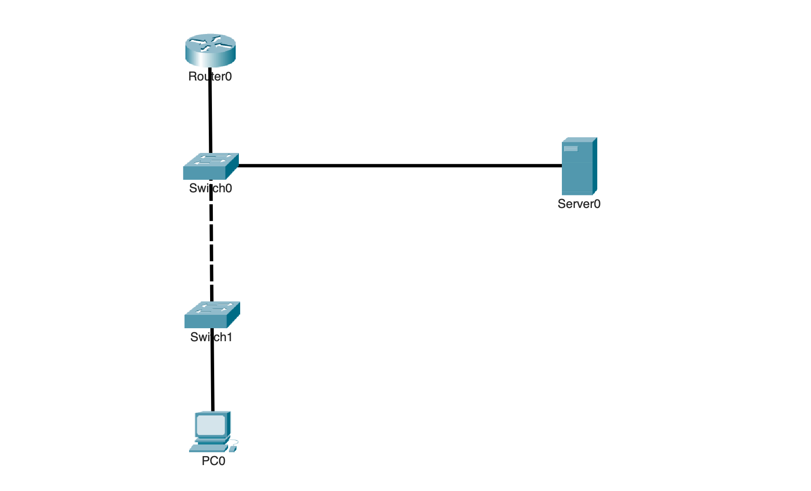
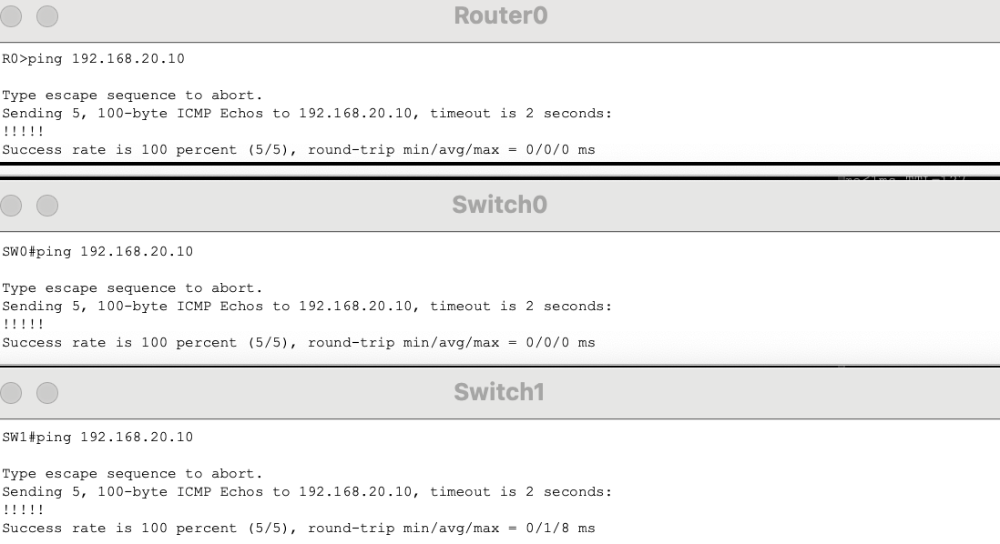
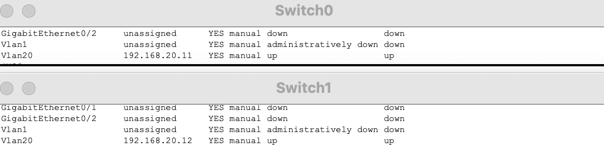
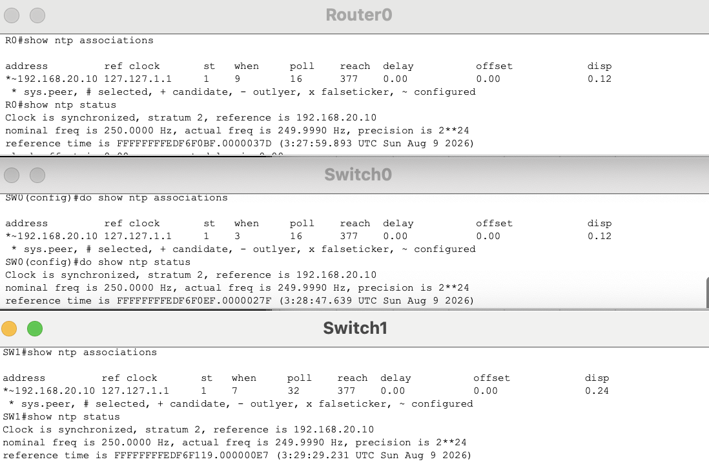
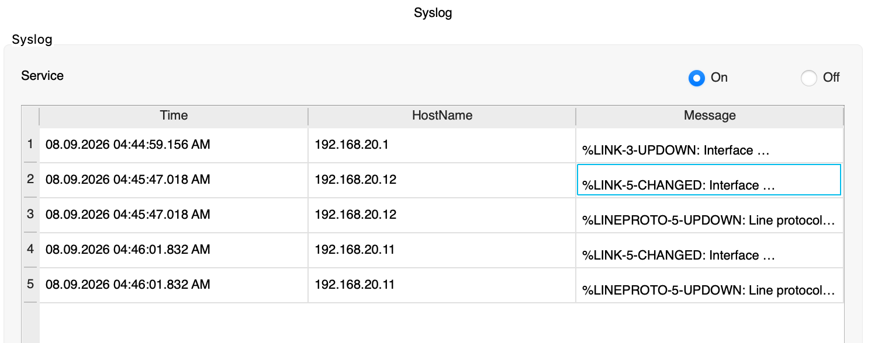
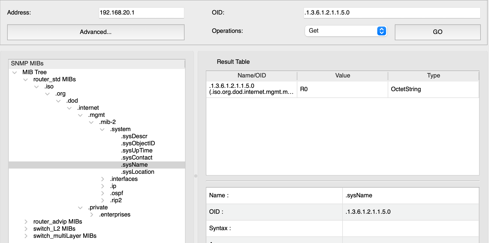

# NTP, Syslog & SNMP

## Overview

This lab shows how NTP synchronizes network device clocks, how Syslog sends device events to a central server, and how SNMP allows device and interface information to be monitored remotely.

The topology uses a router, two switches, and an internal management server. VLAN 20 provides a dedicated management network for the server and switch management interfaces, while VLAN 10 contains an end-user device. The router and switches use the management server for time synchronization, centralized logging, and SNMP monitoring.

---

## Objectives

- Configure a dedicated management VLAN
- Configure management IP addresses on Layer 2 switches
- Provide inter-VLAN routing using Router-on-a-Stick
- Configure centralized NTP time synchronization
- Configure Syslog forwarding to a management server
- Configure read-only SNMP monitoring
- Verify NTP synchronization
- Generate and verify centralized Syslog events
- Verify SNMP communication with network devices
- Test NTP failure and recovery

---

## Topology



VLAN 10 contains the end-user network, while VLAN 20 is used for network management.

The management server and both switch management interfaces are assigned to VLAN 20. R0 provides the default gateway for both VLANs through Router-on-a-Stick.

---

## Network Design

| VLAN | Name | Network | Gateway | Purpose |
|---|---|---|---|---|
| 10 | Users | `192.168.10.0/24` | `192.168.10.1` | End-user network |
| 20 | MANAGEMENT | `192.168.20.0/24` | `192.168.20.1` | Network management services |

### Device Addressing

| Device | Interface | IP Address | Purpose |
|---|---|---|---|
| R0 | VLAN 10 Subinterface | `192.168.10.1/24` | VLAN 10 Default Gateway |
| R0 | VLAN 20 Subinterface | `192.168.20.1/24` | Management Default Gateway |
| PC | NIC | `192.168.10.10/24` | End-User Device |
| Management Server | NIC | `192.168.20.10/24` | NTP, Syslog, and SNMP |
| Switch 1 | VLAN 20 SVI | `192.168.20.11/24` | Switch Management |
| Switch 2 | VLAN 20 SVI | `192.168.20.12/24` | Switch Management |

The switches use their VLAN 20 SVIs for IP-based management while continuing to operate as Layer 2 switches for normal traffic.

---

## Management Services

| Service | Purpose |
|---|---|
| NTP | Keeps network device clocks synchronized |
| Syslog | Sends device events and system messages to a central server |
| SNMP | Provides remote monitoring of device and interface information |

NTP gives the devices a consistent time source, allowing Syslog events from different devices to use comparable timestamps. SNMP provides additional visibility into the current state of the network devices and their interfaces.

---

## Management Network Configuration

VLAN 20 was created as the dedicated management VLAN.

The management server was assigned:

```text
192.168.20.10/24
Gateway: 192.168.20.1
```

Each Layer 2 switch was given an SVI in VLAN 20.

```text
Switch 1: 192.168.20.11/24
Switch 2: 192.168.20.12/24
```

R0 provides the management network gateway through its VLAN 20 subinterface.

```text
192.168.20.1/24
```

The switches use R0 as their default gateway for management traffic that must reach other networks.

---

## Baseline Connectivity

Before configuring NTP, Syslog, or SNMP, IP connectivity to the management server was verified.

The router and both switches successfully reached `192.168.20.10`.

The VLAN 10 client also reached the management server through R0, confirming that Router-on-a-Stick routing between the user and management networks was working.



This established working IP connectivity before the management services were added.

---

## NTP Configuration

The router and both switches were configured to use the internal management server as their NTP source.

```cisco
ntp server 192.168.20.10
```

Using one time source keeps device clocks synchronized and provides consistent timestamps for events generated across the network.

---

## Syslog Configuration

The router and both switches were configured to send Syslog messages to the management server.

```cisco
logging 192.168.20.10
```

This allows events from multiple devices to be collected at `192.168.20.10` instead of requiring each device's local logs to be checked separately.

---

## SNMP Configuration

Read-only SNMP access was configured on the router and switches.

```cisco
snmp-server community <COMMUNITY> ro
```

The management system can use SNMP to retrieve device and interface information without receiving permission to modify the device configuration.

---

# Verification

## Management Address Verification

The switch management interfaces were verified before testing the services.

```cisco
show ip interface brief
```



The output confirmed that the VLAN 20 management interfaces were configured and operational.

---

## NTP Verification

NTP was checked after the router and switches were configured to use `192.168.20.10`.

```cisco
show ntp associations
show ntp status
show clock
```



The output confirmed that the devices formed an association with the management server and synchronized their clocks.

---

## Syslog Verification

The remote logging destination was verified on the network devices.

```cisco
show logging
```


The output confirmed that Syslog messages were configured to be sent to `192.168.20.10`.

---

## Syslog Event Testing

A device event was generated by temporarily changing the state of an interface.

```cisco
interface <INTERFACE>
 shutdown
 no shutdown
```

The Syslog service on the management server was then checked.



The server received the interface state-change messages, confirming that network events were being forwarded to the centralized log server.

Because the devices were synchronized through NTP, the timestamps could also be compared consistently across devices.

---

## SNMP Verification

SNMP communication was tested between the management system and the network devices.



The management system successfully retrieved information from the configured devices, confirming that read-only SNMP monitoring was working.

---

## Centralized Management

The completed design provides three management functions through the internal management network.

```text
                    Management Server
                     192.168.20.10
                    /       |        \
                  NTP     Syslog      SNMP
                   |         |          |
              Router and Managed Switches
```


NTP provides synchronized time, Syslog collects device events, and SNMP provides remote device information.

---

# Failure and Recovery Testing

## NTP Failure

Connectivity between one managed device and the NTP server was temporarily interrupted.

NTP was then checked again.

```cisco
show ntp associations
show ntp status
```


The output showed that normal communication with the configured NTP source was no longer available.

This demonstrated that NTP synchronization depends on reachability to the management server.

---

## NTP Recovery

Connectivity to `192.168.20.10` was restored and NTP was checked again.

```cisco
show ntp associations
show ntp status
show clock
```


The NTP association recovered and the device was again able to synchronize with the management server.

---

## Key Takeaways

- Layer 2 switches require management IP addresses to use IP-based management services
- An SVI provides a Layer 2 switch with an IP interface for management
- A dedicated management VLAN separates management addressing from the user network
- Router-on-a-Stick provides routing between the user and management VLANs
- NTP keeps network device clocks synchronized
- Consistent time makes events from different devices easier to compare
- Syslog sends device events to a centralized server
- SNMP provides remote visibility into device and interface information
- Read-only SNMP allows monitoring without permitting configuration changes
- NTP, Syslog, and SNMP perform different functions but work together as part of centralized network management
- All three services depend on working IP connectivity between the managed devices and the management network
- Verification should prove that each service is actually operating rather than only showing its configuration

---

## Environment

- Cisco Packet Tracer
- Cisco IOS
- IPv4
- VLANs
- Router-on-a-Stick
- Switch Virtual Interfaces
- NTP
- Syslog
- SNMP
