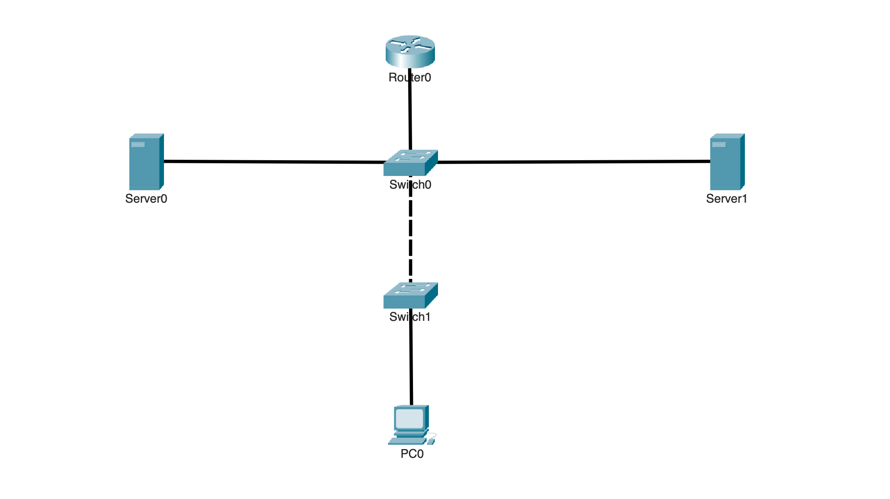

# DNS Name Resolution

## Overview

This lab shows how DNS translates hostnames into IP addresses so users and applications can reach network resources by name instead of remembering addresses.

TThe topology uses a router, two switches, a client, and two internal servers. One server provides DNS, while the other hosts a web service. The client reaches both servers across VLANs through Router-on-a-Stick and uses DNS to resolve the web server’s hostname before connecting to it.

---

## Objectives

- Configure centralized DNS services
- Create DNS records for internal network resources
- Configure a client to use the DNS server
- Provide routing between the user and server networks
- Verify connectivity to the DNS server
- Verify hostname resolution
- Access a network service using a hostname
- Compare successful and failed DNS resolution

---

## Topology



The client is placed on a separate VLAN from the DNS and web servers. R0 routes traffic between the networks using Router-on-a-Stick.

---

## Network Design

| VLAN | Name | Purpose |
|---|---|---|
| 10 | USERS | End-user devices |
| 20 | SERVICES | DNS and internal services |

### Device Addressing

| Device | Purpose |
|---|---|
| R0 | Inter-VLAN routing and default gateways |
| Switch 0 | Layer 2 switching |
| Switch 1 | Layer 2 switching |
| DNS Server | Resolves internal hostnames |
| Web Server | Hosts the internal web service |
| PC | DNS client |

---

## DNS Design

The DNS server provides name resolution for internal network resources.

An A record maps a hostname to an IPv4 address.

```text
intranet.local → <WEB-SERVER-IP>
```

The client is configured to use the DNS server as its DNS resolver.

This allows the client to request the address for `intranet.local` and then use the returned IP address to reach the web server.

---

## Baseline Connectivity

Before configuring DNS, basic IP connectivity was verified.

The client successfully reached both the DNS server and the internal web server using their IP addresses.


This confirmed that routing was working before DNS was added.

---

## DNS Server Configuration

DNS was enabled on the internal server.

An A record was created for the internal web server.

```text
Name: intranet.local
Address: <WEB-SERVER-IP>
```

This record allows the DNS server to return the web server's IP address when a client requests `intranet.local`.

---

## Client DNS Configuration

The client was configured to use the internal DNS server.

```text
DNS Server: <DNS-SERVER-IP>
```

The client can now send DNS queries to the server instead of relying only on direct IP addressing.

---

# Verification

## DNS Record Verification

The configured DNS record was verified on the DNS server.


The record confirmed that `intranet.local` was mapped to the internal web server.

---

## Hostname Resolution

The client tested the hostname instead of the destination IP address.

```text
ping intranet.local
```


The hostname was successfully resolved to the web server's IP address, confirming that DNS resolution was working.

---

## Web Access by Name

The client then accessed the internal web server using the hostname.

```text
http://intranet.local
```


The web page loaded successfully, confirming that the client could resolve the hostname and use the returned address to reach the service.

---

## Failed Resolution Test

A hostname without a DNS record was tested.

```text
ping unknown.local
```


The lookup failed because the DNS server had no matching record for the requested hostname.

This demonstrated that DNS resolution depends on a valid record being available for the requested name.

---

## Key Takeaways

- DNS translates hostnames into IP addresses
- An A record maps a hostname to an IPv4 address
- Clients must know which DNS server to query
- DNS requires IP connectivity between the client and DNS server
- Routing can carry DNS queries between different VLANs
- Successful name resolution does not replace normal IP routing
- DNS allows users and applications to access resources by name instead of IP address
- A missing or incorrect DNS record prevents successful name resolution
- Verification should prove both hostname resolution and access to the actual service

---

## Environment

- Cisco Packet Tracer
- Cisco IOS
- IPv4
- VLANs
- Router-on-a-Stick
- DNS
- HTTP
