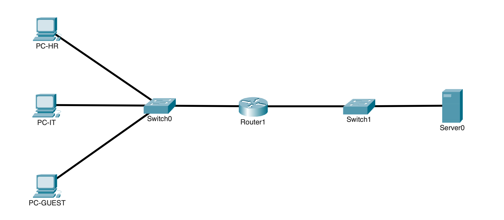
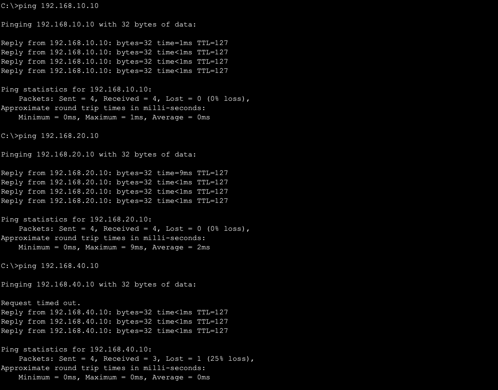

# ACL Traffic Filtering

## Overview

This lab demonstrates how standard and extended IPv4 access control lists control traffic between multiple networks.

HR, IT, and Guest devices are placed in separate VLANs. R1 routes between the client networks and a server network running HTTP, HTTPS, and FTP.

A standard ACL blocks Guest traffic from reaching HR. An extended ACL controls which server services each client network is allowed to use.

---

## Objectives

- Configure a standard IPv4 ACL
- Configure an extended IPv4 ACL
- Filter traffic by source and destination
- Filter traffic by protocol and port
- Apply ACLs in the correct direction
- Verify permitted and denied traffic
- Check ACL match counters
- Test ACL placement and rule order

---

## Topology



R1 provides routing for the HR, IT, and Guest VLANs through Router-on-a-Stick.

A separate interface on R1 connects to the server network.

---

## Network Design

| VLAN | Name | Network | Gateway | Device |
|---|---|---|---|---|
| 10 | HR | `192.168.10.0/24` | `192.168.10.1` | PC-HR: `192.168.10.10` |
| 20 | IT | `192.168.20.0/24` | `192.168.20.1` | PC-IT: `192.168.20.10` |
| 30 | Guest | `192.168.30.0/24` | `192.168.30.1` | PC-GUEST: `192.168.30.10` |
| 40 | Server | `192.168.40.0/24` | `192.168.40.1` | Server: `192.168.40.10` |
| 999 | Native | N/A | N/A | Unused native VLAN |

The server provides HTTP, HTTPS, and FTP services for testing.

---

## Traffic Requirements

### Client Network Access

| Source | Destination | Result |
|---|---|---|
| Guest | HR | Deny |
| Guest | IT | Permit |
| HR | IT | Permit |
| IT | HR | Permit |

### Server Access

| Source | HTTP | HTTPS | FTP | ICMP |
|---|---|---|---|---|
| HR | Permit | Permit | Deny | Deny |
| IT | Permit | Permit | Permit | Deny |
| Guest | Permit | Deny | Deny | Deny |

---

## Baseline Testing

Before applying ACLs, all networks and server services were tested without restrictions.

The clients could communicate between networks and access the server.



This confirmed that the VLANs, routing, addressing, and server services were working before ACL filtering was added.

---

## Standard ACL Configuration

The first requirement is to prevent Guest devices from reaching the HR network.

A named standard ACL was created to deny traffic from the Guest subnet.

```cisco
ip access-list standard BLOCK_GUEST_TO_HR
 deny 192.168.30.0 0.0.0.255
 permit any
```

A standard ACL only checks the source address, so it was placed close to the HR destination.

```cisco
interface GigabitEthernet0/0.10
 ip access-group BLOCK_GUEST_TO_HR out
```

This blocks Guest traffic only when it leaves R1 toward the HR network.

Guest traffic toward IT or the server is not affected by this ACL.

---

## Extended ACL Configuration

The second requirement is to control access to the server.

A named extended ACL was created so each client network could access only the required services.

```cisco
ip access-list extended PROTECT_SERVER

 remark HR_HTTP_AND_HTTPS
 permit tcp 192.168.10.0 0.0.0.255 host 192.168.40.10 eq 80
 permit tcp 192.168.10.0 0.0.0.255 host 192.168.40.10 eq 443

 remark IT_HTTP_HTTPS_AND_FTP
 permit tcp 192.168.20.0 0.0.0.255 host 192.168.40.10 eq 80
 permit tcp 192.168.20.0 0.0.0.255 host 192.168.40.10 eq 443
 permit tcp 192.168.20.0 0.0.0.255 host 192.168.40.10 eq 21

 remark GUEST_HTTP_ONLY
 permit tcp 192.168.30.0 0.0.0.255 host 192.168.40.10 eq 80

 remark DENY_OTHER_CLIENT_ACCESS
 deny ip 192.168.10.0 0.0.0.255 host 192.168.40.10
 deny ip 192.168.20.0 0.0.0.255 host 192.168.40.10
 deny ip 192.168.30.0 0.0.0.255 host 192.168.40.10

 permit ip any any
```

The ACL was applied outbound on the interface toward the server network.

```cisco
interface GigabitEthernet0/1
 ip access-group PROTECT_SERVER out
```

The specific permit rules are placed before the broader deny rules because ACLs are processed from top to bottom.

---

## Verification

### Standard ACL Testing

PC-GUEST attempted to reach PC-HR.

```text
PC-GUEST> ping 192.168.10.10
```


The ping failed as expected.

PC-GUEST then tested connectivity to PC-IT.

```text
PC-GUEST> ping 192.168.20.10
```


The ping succeeded, confirming that Guest traffic was blocked only from the HR network.

---

### Server Access Testing

The clients were tested against the allowed and denied server services.

| Source | Service | Result |
|---|---|---|
| HR | HTTP | Permit |
| HR | HTTPS | Permit |
| HR | FTP | Deny |
| IT | HTTP | Permit |
| IT | HTTPS | Permit |
| IT | FTP | Permit |
| Guest | HTTP | Permit |
| Guest | HTTPS | Deny |
| Guest | FTP | Deny |
| All Clients | ICMP | Deny |


The results matched the required access policy.

---

### ACL Match Counters

The ACLs were checked after testing.

```cisco
show access-lists
```


The output confirmed that traffic was matching the expected permit and deny entries.

The interface placement was also checked.

```cisco
show ip interface GigabitEthernet0/0.10
show ip interface GigabitEthernet0/1
```

---

## Failure and Recovery Testing

### Incorrect Standard ACL Placement

The standard ACL was temporarily applied inbound on the Guest interface instead of outbound toward HR.

This caused Guest traffic to be blocked from every routed destination because the standard ACL could only see the source address.


The ACL was moved back to the HR-facing interface, restoring Guest access to IT and permitted server services.

---

### Rule Order

A broad Guest permit was temporarily placed above the more specific server restrictions.

```cisco
permit ip 192.168.30.0 0.0.0.255 host 192.168.40.10
```

Guest HTTPS and FTP traffic became allowed because ACL processing stopped at the first matching rule.

The broad permit was removed, restoring the intended HTTP-only access.

---

### Implicit Deny

The final permit rule was temporarily removed.

```cisco
permit ip any any
```

Traffic that did not match an earlier permit was blocked by the implicit deny at the end of the ACL.

The rule was restored and normal traffic recovered.


---

## Key Takeaways

- Standard ACLs filter mainly by source address
- Extended ACLs can filter by source, destination, protocol, and port
- Standard ACL placement matters because they cannot see the destination
- ACL direction is based on traffic entering or leaving a router interface
- ACL entries are processed from top to bottom
- The first matching rule determines what happens to the packet
- Every ACL ends with an implicit deny
- Match counters help verify which ACL entries are being used
- Baseline testing helps separate ACL problems from routing problems

---

## Environment

- Cisco Packet Tracer
- Cisco IOS
- IPv4
- Standard and extended ACLs
- Router-on-a-Stick
- HTTP
- HTTPS
- FTP
- ICMP
