# ACL Traffic Filtering

## Overview

This lab shows how standard and extended IPv4 ACLs control traffic between networks and services.

A router connects HR, IT, Guest, and Server networks. A standard ACL blocks Guest traffic from reaching HR, while separate extended ACLs control which HTTP, HTTPS, FTP, and ICMP traffic each client network can send to the server.

---

## Objectives

- Configure standard and extended IPv4 ACLs
- Match traffic using source and destination addresses
- Filter traffic by protocol and TCP port
- Apply standard ACLs close to the destination
- Apply extended ACLs close to the source
- Apply ACLs in the correct direction
- Verify ACL configuration and interface attachment
- Verify permitted and denied traffic
- Inspect ACL match counters
- Demonstrate first-match and implicit deny behavior
- Test failure and recovery after ACL mistakes

---

## Topology


R0 uses Router-on-a-Stick for the HR, IT, and Guest VLANs. A separate physical interface connects the server network.

---

## Network Design

| VLAN | Name | Network | Gateway | Endpoint |
|---|---|---|---|---|
| 10 | HR | `192.168.10.0/24` | `192.168.10.1` | PC-HR: `192.168.10.10` |
| 20 | IT | `192.168.20.0/24` | `192.168.20.1` | PC-IT: `192.168.20.10` |
| 30 | Guest | `192.168.30.0/24` | `192.168.30.1` | PC-GUEST: `192.168.30.10` |
| 40 | Server | `192.168.40.0/24` | `192.168.40.1` | SERVER: `192.168.40.10` |
| 999 | Native | N/A | N/A | Unused native VLAN |

The server provides HTTP, HTTPS, and FTP services for ACL testing.

---

## Security Requirements

### Client Network Filtering

The Guest network must not be allowed to reach the HR network.

| Source | Destination | Result |
|---|---|---|
| Guest | HR | Deny |
| Guest | IT | Permit |
| HR | IT | Permit |
| IT | HR | Permit |

### Server Access

| Source | HTTP | HTTPS | FTP | ICMP |
|---|---:|---:|---:|---:|
| HR | Permit | Permit | Deny | Deny |
| IT | Permit | Permit | Permit | Deny |
| Guest | Permit | Deny | Deny | Deny |

---

## Baseline Connectivity

Before applying ACLs, routing and server connectivity were tested without restrictions.

The client networks could communicate with each other, ping the server, and access its enabled services.


This confirmed that later traffic failures were caused by ACL filtering rather than an addressing, VLAN, trunking, routing, or server problem.

---

## Standard ACL Configuration

A named standard ACL was created to prevent traffic sourced from the Guest network from reaching HR.

```cisco
ip access-list standard BLOCK_GUEST_TO_HR
 deny 192.168.30.0 0.0.0.255
 permit any
```

Because a standard ACL matches only the source IPv4 address, it was placed close to the HR destination.

```cisco
interface GigabitEthernet0/0.10
 ip access-group BLOCK_GUEST_TO_HR out
```

Applying the ACL outbound on the HR subinterface blocks Guest traffic only when it is leaving R0 toward the HR network.

Guest traffic toward IT and the server leaves through different interfaces and is not affected by this ACL.

---

## Extended ACL Configuration

Separate extended ACLs were created for the HR, IT, and Guest networks.

Extended ACLs can match the source address, destination address, protocol, and port. This allows each client network to have its own server access policy while filtering unwanted traffic close to the source.

### HR ACL

HR is allowed to use HTTP and HTTPS on the server.

FTP and ICMP traffic to the server are denied.

```cisco
ip access-list extended HR
 permit tcp 192.168.10.0 0.0.0.255 host 192.168.40.10 eq 80
 permit tcp 192.168.10.0 0.0.0.255 host 192.168.40.10 eq 443
 deny tcp 192.168.10.0 0.0.0.255 host 192.168.40.10 eq 21
 deny icmp 192.168.10.0 0.0.0.255 host 192.168.40.10
 permit ip any any
```

The ACL was applied inbound on the HR subinterface.

```cisco
interface GigabitEthernet0/0.10
 ip access-group HR in
```

The HR subinterface therefore uses two ACLs in different directions:

```text
Inbound  → HR
Outbound → BLOCK_GUEST_TO_HR
```

The inbound extended ACL controls traffic originating from HR, while the outbound standard ACL controls traffic being forwarded toward HR.

---

### IT ACL

IT is allowed to use HTTP, HTTPS, and FTP on the server.

ICMP traffic to the server is denied.

```cisco
ip access-list extended IT
 permit tcp 192.168.20.0 0.0.0.255 host 192.168.40.10 eq 80
 permit tcp 192.168.20.0 0.0.0.255 host 192.168.40.10 eq 443
 permit tcp 192.168.20.0 0.0.0.255 host 192.168.40.10 eq 21
 deny icmp 192.168.20.0 0.0.0.255 host 192.168.40.10
 permit ip any any
```

The ACL was applied inbound on the IT subinterface.

```cisco
interface GigabitEthernet0/0.20
 ip access-group IT in
```

---

### Guest ACL

Guest is allowed to use HTTP on the server.

HTTPS, FTP, and ICMP traffic to the server are denied.

```cisco
ip access-list extended GUEST
 permit tcp 192.168.30.0 0.0.0.255 host 192.168.40.10 eq 80
 deny tcp 192.168.30.0 0.0.0.255 host 192.168.40.10 eq 443
 deny tcp 192.168.30.0 0.0.0.255 host 192.168.40.10 eq 21
 deny icmp 192.168.30.0 0.0.0.255 host 192.168.40.10
 permit ip any any
```

The ACL was applied inbound on the Guest subinterface.

```cisco
interface GigabitEthernet0/0.30
 ip access-group GUEST in
```

Each extended ACL ends with:

```cisco
permit ip any any
```

This allows unrelated routed traffic to continue instead of being blocked by the implicit deny at the end of the ACL.

---

# Verification

## Standard ACL Verification

### ACL Rules

The standard ACL was checked on R0.

```cisco
show ip access-lists
```

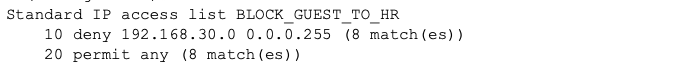

The output confirmed that:

- Traffic sourced from `192.168.30.0/24` was denied
- Other source addresses were permitted
- Match counters increased as traffic was tested

---

### Interface Attachment

The HR subinterface was checked to verify where the standard ACL was applied.

```cisco
show ip interface GigabitEthernet0/0.10
```

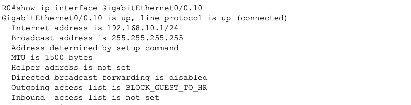

The output confirmed that `BLOCK_GUEST_TO_HR` was applied outbound toward HR.

---

### Guest-to-HR Deny Test

PC-GUEST attempted to reach PC-HR.

```text
PC-GUEST> ping 192.168.10.10
```

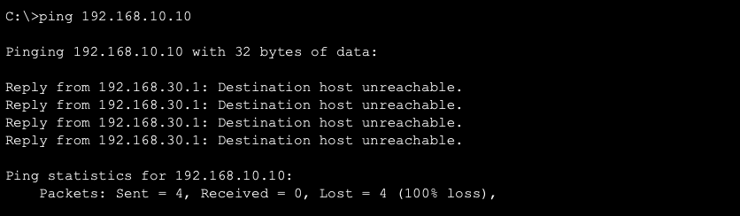

The ping failed because Guest traffic matched the standard ACL deny entry.

---

### Guest-to-IT Permit Test

PC-GUEST then attempted to reach PC-IT.

```text
PC-GUEST> ping 192.168.20.10
```

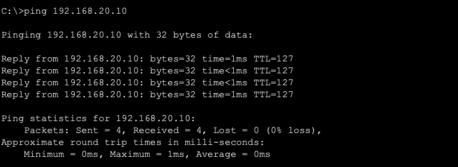

The ping succeeded because traffic toward IT does not leave through the HR subinterface.

---

## Extended ACL Verification

### ACL Rules

The three extended ACLs were checked on R0.

```cisco
show ip access-lists
```

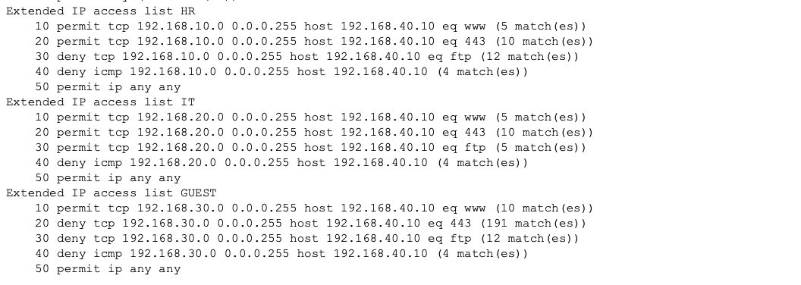

The output confirmed that separate `HR`, `IT`, and `GUEST` policies were installed.

Each ACL contained the required HTTP, HTTPS, FTP, and ICMP rules for its source network.

---

### HR Interface Attachment

The HR subinterface was checked to verify the ACLs applied in both directions.

```cisco
show ip interface GigabitEthernet0/0.10
```

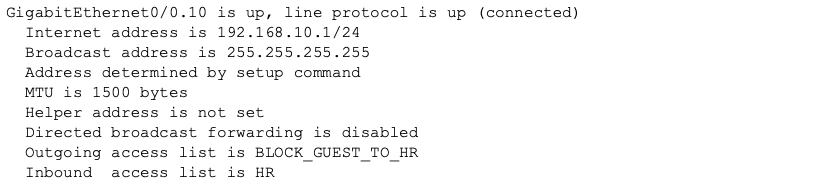

The output confirmed that:

- `HR` was applied inbound on `G0/0.10`
- `BLOCK_GUEST_TO_HR` remained applied outbound on `G0/0.10`

---

### IT Interface Attachment

The IT subinterface was checked to verify its extended ACL.

```cisco
show ip interface GigabitEthernet0/0.20
```

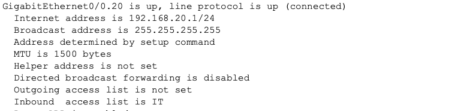

The output confirmed that `IT` was applied inbound on `G0/0.20`.

---

### Guest Interface Attachment

The Guest subinterface was checked to verify its extended ACL.

```cisco
show ip interface GigabitEthernet0/0.30
```

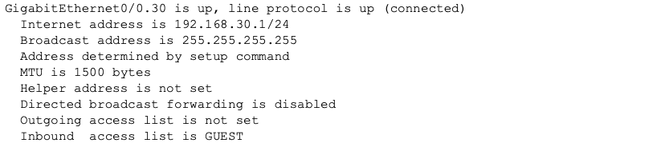

The output confirmed that `GUEST` was applied inbound on `G0/0.30`.

This places each extended ACL close to its source network while keeping the standard ACL close to the HR destination.

---

## Server Access Testing

The completed ACL policy was tested from all three client networks.

| Source | Traffic | Result |
|---|---|---|
| HR | HTTP | Permit |
| HR | HTTPS | Permit |
| HR | FTP | Deny |
| HR | ICMP | Deny |
| IT | HTTP | Permit |
| IT | HTTPS | Permit |
| IT | FTP | Permit |
| IT | ICMP | Deny |
| Guest | HTTP | Permit |
| Guest | HTTPS | Deny |
| Guest | FTP | Deny |
| Guest | ICMP | Deny |

---

### HTTP Testing

HTTP access to the server was tested from the client networks.

```text
http://192.168.40.10
```

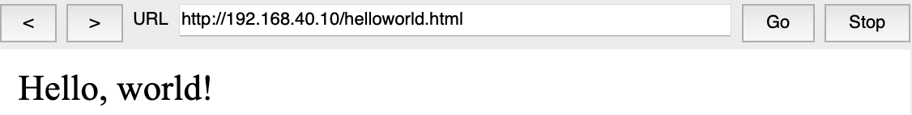

HTTP access succeeded as required.

---

### FTP Testing

FTP access was tested against the server.

```text
ftp 192.168.40.10
```

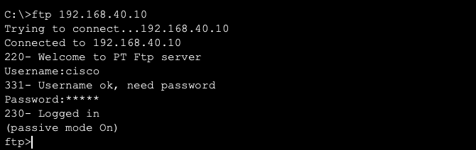

FTP succeeded from IT and was blocked from HR and Guest.

---

### Unauthorized Traffic Testing

Unauthorized server traffic was tested from the appropriate client networks.

This included:

- Guest HTTPS
- Guest FTP
- HR FTP
- HR ICMP
- IT ICMP
- Guest ICMP

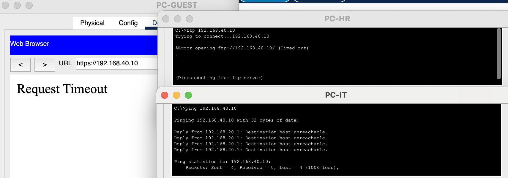

The unauthorized traffic was blocked according to the required policy.

---

### ACL Match Counters

After traffic testing, the ACLs were checked again.

```cisco
show ip access-lists
```

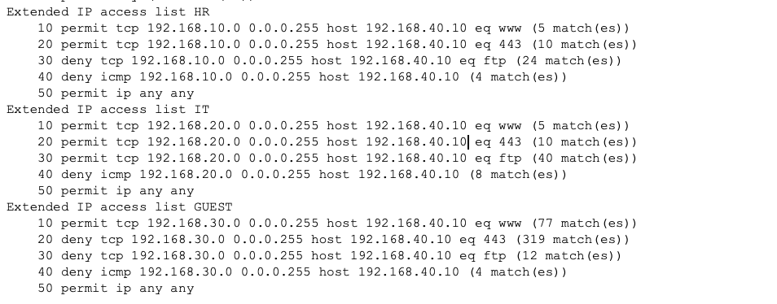

The match counters were used to confirm that traffic was reaching the expected permit and deny entries.

This provided direct verification that the ACL rules, rather than another network problem, were responsible for the observed traffic behavior.

---

# Failure and Recovery Testing

## Incorrect Standard ACL Placement

The standard ACL was temporarily moved close to the Guest source instead of remaining near the HR destination.

Because the ACL could identify only the source address, Guest traffic toward multiple destinations became blocked.

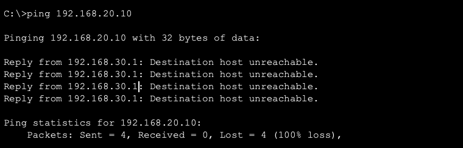

The ACL was returned to the HR subinterface in the outbound direction.

Guest access to permitted networks recovered while Guest access to HR remained blocked.

---

## First-Match Processing

ACL entries are processed from top to bottom.

A broader permit placed above a more specific restriction can allow traffic before the packet reaches the intended deny entry.

The ACL order was tested and then restored so the required service rules were processed correctly.

---

## Implicit Deny

Every ACL contains an implicit deny at the end.

The final:

```cisco
permit ip any any
```

entry was temporarily removed to demonstrate what happens to traffic that does not match an earlier permit.

Unrelated routed traffic became blocked by the implicit deny.

The permit entry was restored and normal connectivity recovered.

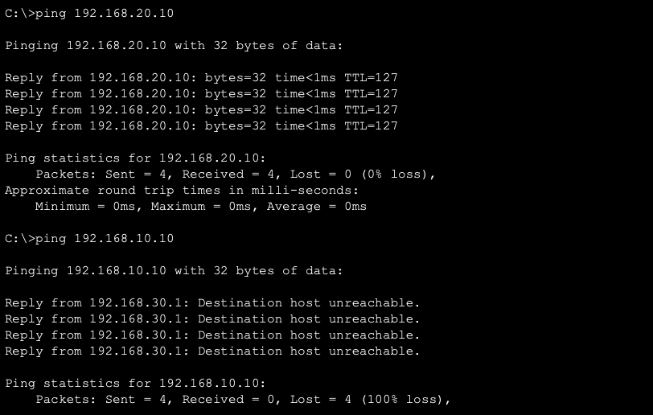

---

## Key Takeaways

- Standard ACLs match only the source IPv4 address
- Extended ACLs can match source, destination, protocol, and port
- Standard ACLs are normally placed close to the destination
- Extended ACLs are normally placed close to the source
- Separate ACLs can make policies for different source networks easier to read and troubleshoot
- An interface can use one IPv4 ACL inbound and another IPv4 ACL outbound
- ACL direction is determined from the router's perspective
- Inbound ACLs process traffic as it enters the router interface
- Outbound ACLs process traffic as it leaves the router interface
- ACL entries are evaluated from top to bottom
- The first matching entry determines the result
- Every ACL ends with an implicit deny
- A final permit can preserve traffic that is outside the intended filtering policy
- `show ip access-lists` verifies ACL entries and match counters
- `show ip interface` verifies ACL attachment and direction
- Incorrect placement or rule order can block or permit more traffic than intended
- Baseline testing helps separate ACL problems from routing problems

---

## Environment

- Cisco Packet Tracer
- Cisco IOS
- IPv4
- Standard and extended ACLs
- Router-on-a-Stick
- HTTP
- HTTPS
- FTP
- ICMP
