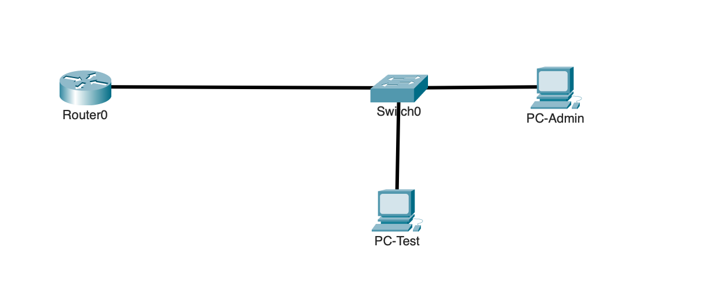
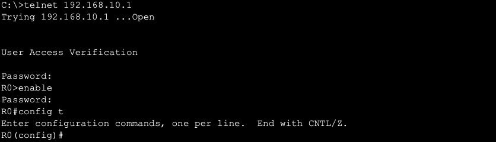
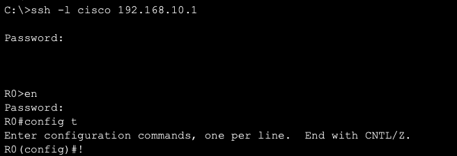
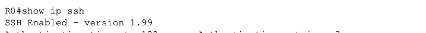

# Secure Remote Management

## Overview

This lab demonstrates how Cisco network devices can be managed remotely and how that access can be secured.

The lab begins by using Telnet to verify basic remote CLI access with VTY password authentication. SSH is then configured using local authentication to provide encrypted remote access. Finally, the VTY lines are restricted to SSH only, and a VTY ACL is added so only the administrator PC can remotely manage the devices.

---

## Objectives

- Configure and test Telnet remote access
- Configure Privileged EXEC access for remote sessions
- Configure SSH version 2
- Use local authentication for SSH
- Restrict VTY lines to SSH only
- Restrict remote management to an authorized PC
- Verify successful and failed remote-access attempts

---

## Topology



The topology uses one router, one switch, and two PCs on the same network.

PC-Admin is used to remotely manage R0 and SW0. PC-Test is used later to verify that unauthorized devices cannot access the VTY lines.

---

## Network Design

| Device | IP Address | Role |
|---|---|---|
| R0 | `192.168.10.1` | Remotely managed router |
| SW0 | `192.168.10.10` | Remotely managed switch |
| PC-Admin | `192.168.10.11` | Authorized management PC |
| PC-Test | `192.168.10.12` | Unauthorized test PC |

---

## Baseline Connectivity

Before configuring remote access, both network devices were verified as reachable.

```text
ping 192.168.10.1
ping 192.168.10.10
```

PC-Test was also able to reach both devices.

This confirmed that normal IP connectivity was working before remote-management configuration began.

---

## Telnet Configuration

Telnet was configured first to verify basic remote CLI access.

The VTY lines were configured with a password:

```text
line vty 0 15
 password cisco
 login
```

The VTY password is set with `password`, and `login` tells the VTY lines to require it for remote access.

PC-Admin then used Packet Tracer's Telnet/SSH application to connect to:

```text
R0  - 192.168.10.1
SW0 - 192.168.10.10
```

The VTY password was entered when prompted.



Both connections succeeded.

No explicit `transport input` command was configured yet. On the Packet Tracer devices used in this lab, Telnet was already accepted by the existing VTY settings.

---

## Privileged EXEC Access

The Telnet session initially entered User EXEC mode:

```text
R0>
```

A remote VTY session cannot enter Privileged EXEC mode unless an enable password or enable secret has been configured.

An enable secret was configured locally on each device:

```text
enable secret cisco
```

After reconnecting:

```text
R0> enable
Password:
R0#
```

The VTY password controls the remote login, while the enable secret controls access from User EXEC mode to Privileged EXEC mode.

---

## SSH Configuration

SSH was configured next to replace Telnet with encrypted remote access.

A local user account was created:

```text
username cisco secret cisco
```

The VTY lines were then changed to use the local user database:

```text
line vty 0 15
 login local
```

SSH also requires a hostname, domain name, and RSA keys.

```text
hostname R0
ip domain-name <domain-name>
crypto key generate rsa
```

SW0 was configured the same way using its own hostname.

A key size of at least 768 bits was used for SSH version 2.

SSH version 2 was then configured:

```text
ip ssh version 2
```

PC-Admin used the Telnet/SSH application to connect to both devices using the local username and password.



Both SSH connections succeeded.

At this point, SSH was working but Telnet had not yet been blocked.

---

## VTY Hardening

After SSH was verified, the VTY lines were restricted to SSH only.

```text
line vty 0 15
 transport input ssh
```

`transport input ssh` allows SSH remote access while blocking Telnet.

A standard ACL was then created so only PC-Admin could access the VTY lines.

```text
ip access-list standard VTY-MANAGEMENT
 permit host 192.168.10.11
```

The ACL was applied directly to the VTY lines:

```text
line vty 0 15
 access-class VTY-MANAGEMENT in
```

Unlike an interface ACL, this ACL controls access specifically to the device's remote-management lines.

The final VTY configuration uses:

```text
line vty 0 15
 login local
 transport input ssh
 access-class VTY-MANAGEMENT in
```

---

# Verification

## SSH Status

SSH status was verified on both devices.

```text
show ip ssh
```



The output confirmed that SSH version 2 was active.

---

## SSH Access After Hardening

PC-Admin connected to R0 and SW0 through SSH again.


Both connections succeeded, confirming that legitimate remote management still worked after hardening.

---

## Telnet Blocking Test

PC-Admin attempted to connect using Telnet.


Telnet failed while ping and SSH continued to work.

```text
Ping    → Works
SSH     → Works
Telnet  → Fails
```

This confirmed that the VTY transport setting was blocking Telnet.

---

## Authorized Management Test

PC-Admin at `192.168.10.11` connected through SSH after the VTY ACL was applied.


SSH succeeded because PC-Admin was permitted by the ACL.

---

## Unauthorized Management Test

PC-Test at `192.168.10.12` attempted to connect through SSH.


The SSH connection failed, but PC-Test could still ping the devices.

```text
PC-Test ping → Works
PC-Test SSH  → Fails
```

This confirmed that the VTY ACL blocked remote management without blocking normal network connectivity.

---

## Failed Authentication Test

PC-Admin attempted an SSH connection using incorrect credentials.


The connection reached the device, but authentication failed.

This confirmed that source authorization and user authentication are separate controls.

---

## Active SSH Session

An active SSH session was verified using:

```text
show users
```

or:

```text
show ssh
```


---

## Final VTY Configuration

The final VTY configuration was verified with:

```text
show running-config | section line vty
```

The important settings are:

```text
login local
transport input ssh
access-class VTY-MANAGEMENT in
```

| Setting | Purpose |
|---|---|
| `login local` | Uses the local user database for authentication |
| `transport input ssh` | Allows only SSH |
| `access-class VTY-MANAGEMENT in` | Restricts which source IPs can access the VTY lines |

---

## Key Takeaways

- Telnet and SSH both use VTY lines for remote CLI access
- Telnet was first tested using a VTY password with `login`
- Remote users need an enable secret to enter Privileged EXEC mode
- SSH uses a local username and password with `login local`
- SSH provides encrypted remote access
- RSA keys and SSH version 2 are required for the SSH configuration used in this lab
- `transport input ssh` blocks Telnet and allows only SSH
- `access-class` applies an ACL directly to VTY access
- A VTY ACL can restrict remote management without blocking normal connectivity

---

## Environment

- Cisco Packet Tracer
- Cisco IOS
- IPv4
- Telnet
- SSH Version 2
- RSA
- VTY lines
- Local authentication
- Standard ACL
