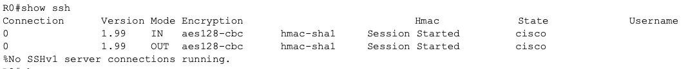

# Secure Remote Management

## Overview

This lab shows how Cisco network devices can be managed remotely through the command line and how that access can be secured.

The lab first uses Telnet to demonstrate basic remote CLI access, then replaces it with SSH. The VTY lines are configured to require local authentication and allow only SSH so insecure Telnet access is blocked.

---

## Objectives

- Configure remote CLI access to Cisco devices
- Use Telnet as a baseline remote-management method
- Configure SSH for encrypted remote access
- Create local user accounts for authentication
- Configure VTY lines for remote management
- Restrict VTY access to SSH only
- Verify successful SSH connections
- Verify Telnet is blocked after hardening
- Test failed authentication attempts
- Verify active remote sessions

---

## Topology


The topology uses a router, a switch, and an administrator PC.

The administrator PC is used to remotely access the router and switch. Both network devices have reachable management addresses so remote CLI connections can be tested.

---

## Network Design

| Device | Role |
|---|---|
| R1 | Router and remotely managed device |
| SW1 | Switch and remotely managed device |
| PC-Admin | Administrator workstation |

Basic IP connectivity should be working before remote management is configured.

---

## Baseline Connectivity

Before testing remote access, verify that the administrator PC can reach both network devices.

```text
ping <R1-management-IP>
ping <SW1-management-IP>
```

This confirms that the network path is working before Telnet or SSH is configured.

---

## Telnet Remote Access

Telnet is configured first to demonstrate basic remote CLI access.

The VTY lines are used by Cisco IOS to accept remote terminal connections.

A password is configured on the VTY lines and Telnet is allowed as the remote-access protocol.

After configuration, the administrator PC connects to the device using:

```text
telnet <management-IP>
```


A successful connection confirms that the device can be managed remotely through its CLI.

Telnet provides remote access, but the session is not encrypted.

---

## Local User Authentication

A local administrator account is created on each device.

```text
username <username> privilege 15 secret <password>
```

The account will later be used to authenticate SSH connections.

Using a secret protects the configured password instead of storing it as plain text.

---

## SSH Configuration

SSH requires the device to have identity information and cryptographic keys.

Configure:

- Device hostname
- Domain name
- Local user account
- RSA keys
- SSH version 2

Example:

```text
hostname R1
ip domain-name lab.local
crypto key generate rsa
ip ssh version 2
```

The same process is completed on the switch.

---

## VTY Hardening

The VTY lines are changed to use the local username database and accept SSH connections only.

```text
line vty 0 4
 login local
 transport input ssh
```

`login local` requires users to authenticate using an account configured on the device.

`transport input ssh` prevents Telnet from being accepted on those VTY lines.

---

# Verification

## SSH Status

Verify that SSH is enabled.

```text
show ip ssh
```


The output should confirm that SSH version 2 is active.

---

## Successful SSH Access

From the administrator PC, connect to the router using SSH.

```text
ssh -l <username> <R1-management-IP>
```


Repeat the test against the switch.

```text
ssh -l <username> <SW1-management-IP>
```


Successful connections confirm that remote CLI management is working through SSH.

---

## Telnet Blocking Test

After the VTY lines are restricted to SSH, attempt another Telnet connection.

```text
telnet <management-IP>
```


The connection should fail because Telnet is no longer permitted on the VTY lines.

This confirms that remote management is still available while the insecure protocol has been removed.

---

## Failed Authentication Test

Attempt to connect with an incorrect username or password.


The device should reject the login attempt.

This confirms that network access to the SSH service does not automatically provide administrative access.

---

## Active Session Verification

While connected through SSH, verify the active remote session.

```text
show users
```

or:

```text
show ssh
```



The output should show the active administrative connection.

---

## VTY Configuration Verification

Verify the VTY configuration.

```text
show running-config | section line vty
```

The configuration should show local authentication and SSH-only access.

```text
line vty 0 4
 login local
 transport input ssh
```

---

## Key Takeaways

- Telnet and SSH both provide remote CLI access to network devices
- VTY lines control remote terminal access on Cisco IOS devices
- Telnet provides remote management but does not encrypt the session
- SSH provides encrypted remote management
- SSH requires device identity information and RSA keys
- Local user accounts can be used to authenticate remote administrators
- `login local` tells the VTY lines to use the local username database
- `transport input ssh` prevents Telnet access
- Remote connectivity and authentication are separate requirements
- Secure remote management should be verified by proving SSH works and Telnet does not

---

## Environment

- Cisco Packet Tracer
- Cisco IOS
- IPv4
- Telnet
- SSH
- VTY lines
- Local authentication
