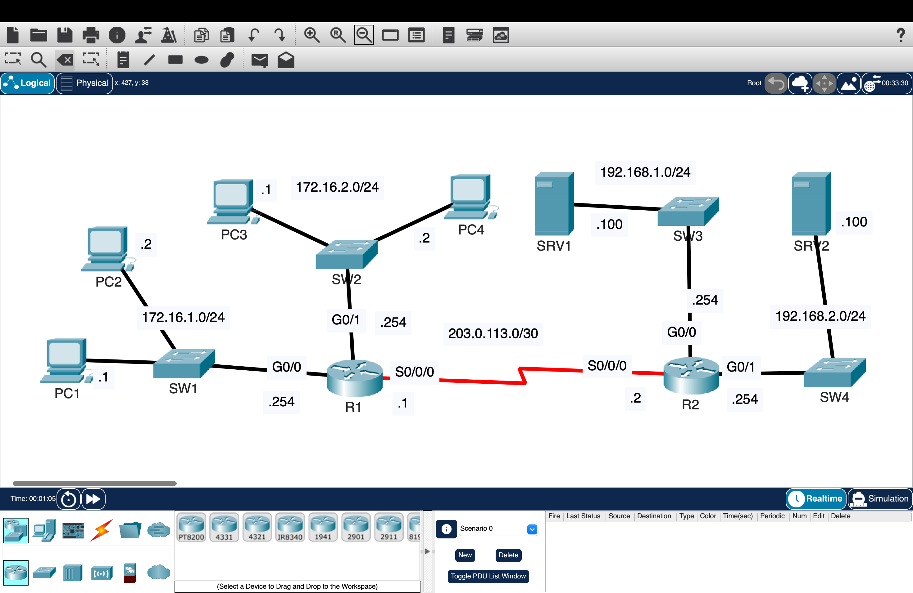
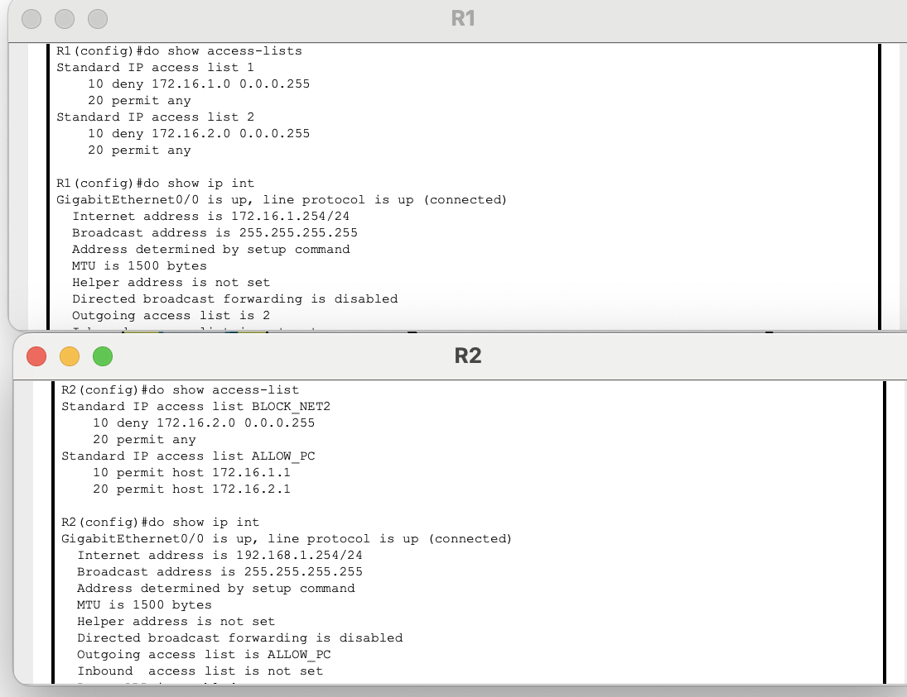
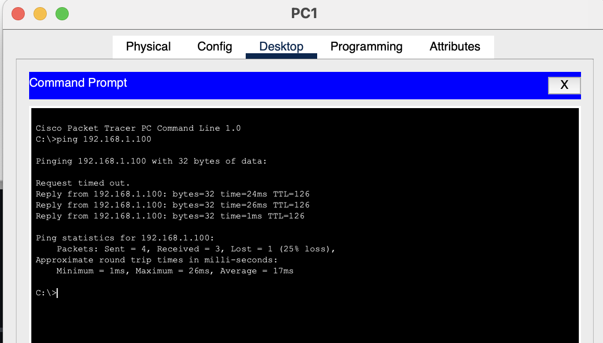
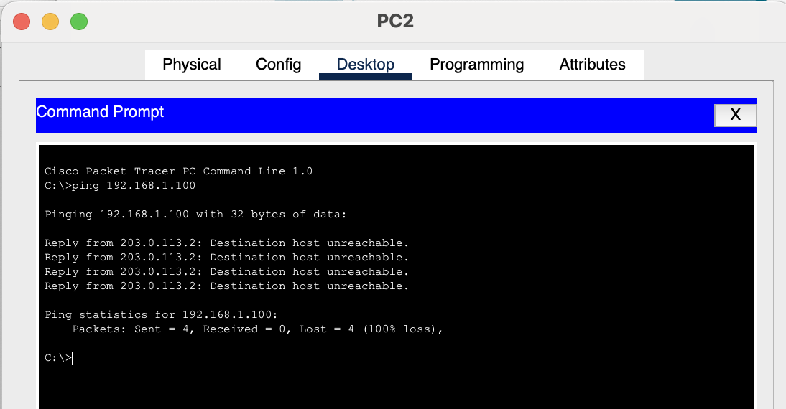
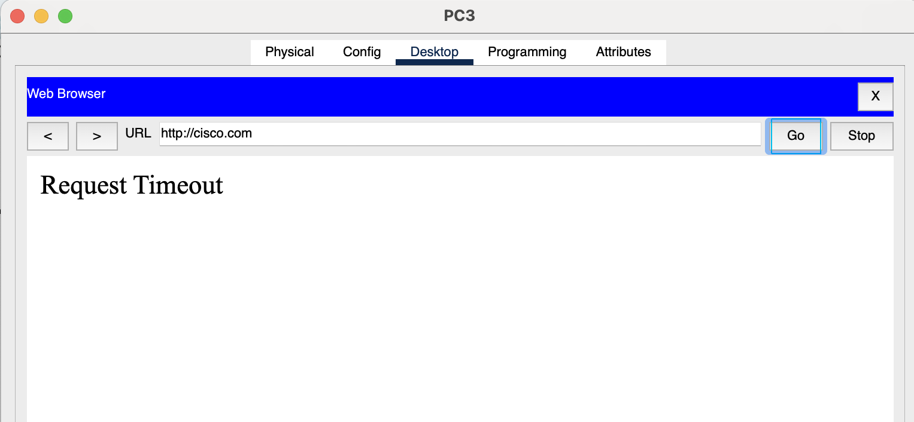
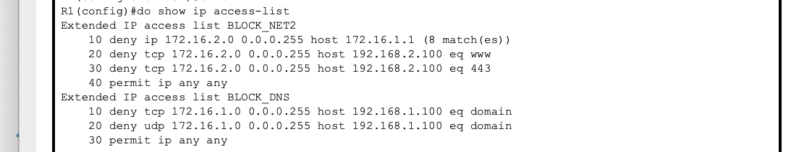

# ACLs – Traffic Filtering, Policy Enforcement, and Access Control

Designed and implemented standard and extended Access Control Lists (ACLs) to control traffic flow across a multi-router network, enforce segmentation policies, and restrict access to specific hosts and services.

---

## Overview

This lab demonstrates how traffic control is progressively enforced on the same network using different types of ACLs.

The same topology is used to apply increasing levels of control:

- Standard ACLs for basic network-level filtering  
- Extended ACLs for granular host and service-level restrictions  

Focus is placed on how traffic is intentionally allowed or denied, and how ACL placement affects behavior.

---

## Topology

---

# Part 1 — Standard and Named ACLs (Network-Level Control)

## Configuration

- Configured OSPF between R1 and R2 for full connectivity  
- Applied standard numbered ACLs on R1  
- Applied standard named ACLs on R2  

### Policies Enforced

- Only PC1 and PC3 can access 192.168.1.0/24  
- 172.16.2.0/24 cannot access 192.168.2.0/24  
- 172.16.1.0/24 cannot access 172.16.2.0/24  
- 172.16.2.0/24 cannot access 172.16.1.0/24  

---

## Configuration Proof

- Verified ACL entries using `show access-lists`  
- Confirmed correct permit and deny statements  
- Verified ACL applied using `show ip interface`  

---

## Validation

  

### Tests Performed

- PC1 → 192.168.1.100 (Allowed)  
- PC3 → 192.168.1.100 (Allowed)  
- PC2 → 192.168.1.100 (Denied)  
- 172.16.1.0 → 172.16.2.0 (Denied)  
- 172.16.2.0 → 172.16.1.0 (Denied)  

### Result

- Allowed traffic succeeded  
- Denied traffic failed as expected  

---

## Behavior

- Standard ACLs filter based only on source IP  
- Placement determines how much traffic is blocked  
- Routing operates first, ACLs enforce restrictions  

---

# Part 2 — Extended ACLs (Granular Traffic + Service Control)

## Configuration

### Policies Enforced

- 172.16.2.0/24 cannot communicate with PC1  
- 172.16.1.0/24 cannot access DNS service on SRV1  
- 172.16.2.0/24 cannot access HTTP or HTTPS on SRV2  

---

## Configuration Proof

- Verified extended ACL entries using `show access-lists`  
- Confirmed protocol and port filtering (DNS, HTTP, HTTPS)  
- Verified ACL applied to correct interface  

---

## Validation

  
  

### Tests Performed

- 172.16.2.x → PC1 (Denied)  
- 172.16.1.x → SRV1 DNS (Denied)  
- 172.16.2.x → SRV2 HTTP/HTTPS (Denied)  
- Other traffic (Allowed)  

### Result

- Service-specific restrictions worked as expected  
- Only targeted traffic was blocked  
- Normal communication remained functional  

---

## Behavior

- Extended ACLs filter based on:
  - Source IP  
  - Destination IP  
  - Protocol  
  - Port  

- Enables precise control over services and hosts  
- Placement near the source reduces unnecessary traffic  

---

## Key Takeaways

- ACLs enforce control over how traffic moves through a network  
- Standard ACLs provide basic filtering  
- Extended ACLs enable granular, real-world control  
- Placement determines effectiveness  
- Validation is required to confirm intended behavior  

---

## Security Impact

- Prevents unauthorized lateral movement between subnets  
- Restricts access to critical services (DNS, HTTP, HTTPS)  
- Reduces attack surface by limiting unnecessary communication  

---

## Environment

Cisco Packet Tracer
