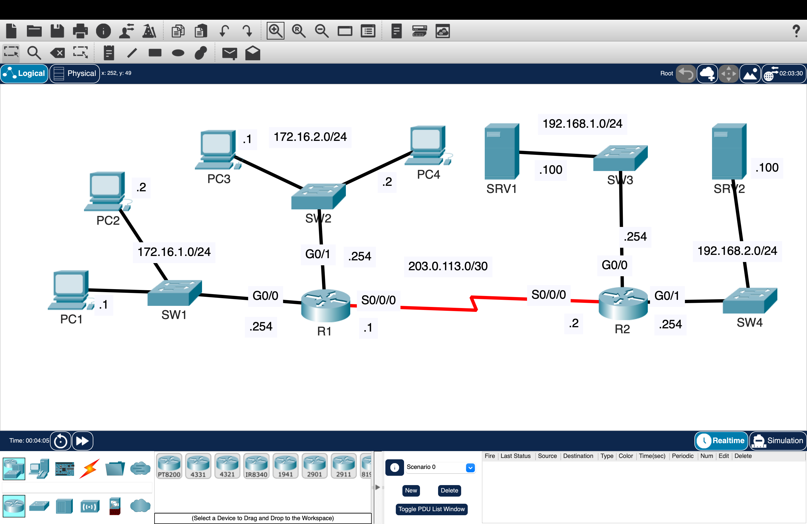

# ACLs – Traffic Filtering, Policy Enforcement, and Access Control

Designed and implemented standard and extended Access Control Lists (ACLs) to control traffic flow between subnets, enforce network policies, and restrict access to specific hosts and services.

---

## Overview

This lab demonstrates how ACLs are used to enforce control over network traffic.

The project is split into two parts:

- Standard and named ACLs for network-level filtering
- Extended ACLs for host and service-level control

Focus is placed on how traffic is intentionally allowed or denied, and how placement impacts behavior.

---

# Part 1 — Standard and Named ACLs (Network-Level Control)

## Topology

---

## Configuration

- Configured OSPF between R1 and R2 for full connectivity
- Applied standard numbered ACLs on R1
- Applied standard named ACLs on R2

### Policies Enforced

- Only PC1 and PC3 can access 192.168.1.0/24  
- 172.16.2.0/24 cannot access 192.168.2.0/24  
- 172.16.1.0/24 cannot access 172.16.2.0/24  
- 172.16.2.0/24 cannot access 172.16.1.0/24  

---

## Behavior

- Traffic is filtered based only on source IP
- ACL placement affects how much traffic is blocked
- Routing works first, ACLs then restrict traffic

---

# Part 2 — Extended ACLs (Granular Traffic + Service Control)

## Topology

---

## Configuration

### Policies Enforced

- 172.16.2.0/24 cannot communicate with PC1  
- 172.16.1.0/24 cannot access DNS service on SRV1  
- 172.16.2.0/24 cannot access HTTP or HTTPS on SRV2  

---

## Behavior

- Traffic is filtered based on:
  - Source IP
  - Destination IP
  - Protocol
  - Port

- Specific services (DNS, HTTP, HTTPS) can be blocked without affecting other traffic
- ACLs applied close to the source reduce unnecessary traffic across the network

---

## Validation

- Verified full connectivity before applying ACLs  
- Tested allowed and denied traffic using ping and application-level requests  

### Results

- Allowed traffic succeeded  
- Denied traffic failed as expected  

---

## Key Takeaways

- ACLs enforce control over how traffic moves through a network  
- Standard ACLs provide basic filtering  
- Extended ACLs provide precise, real-world control  
- Placement determines effectiveness  
- Proper validation is required to confirm intended behavior  

---

## Environment

Cisco Packet Tracer
