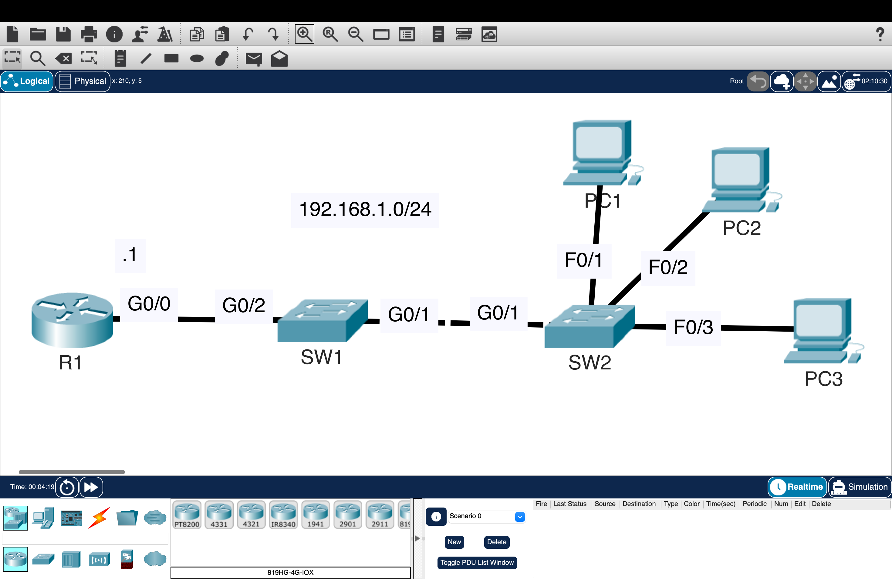
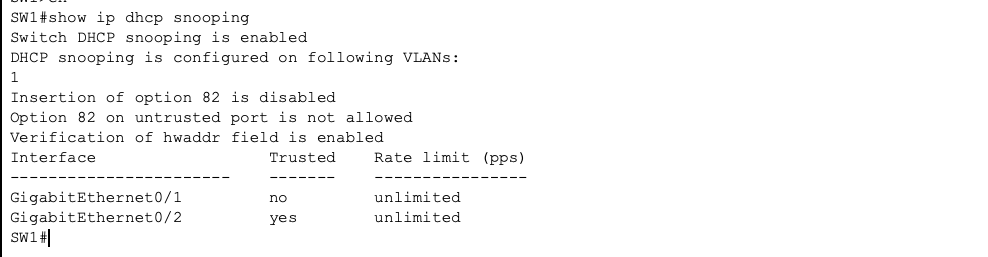
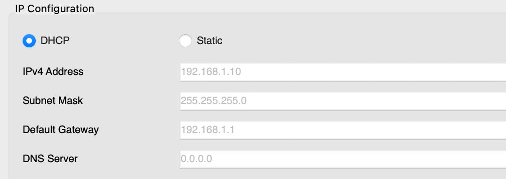

# DHCP Snooping – Preventing Rogue DHCP Servers

Configured Cisco DHCP Snooping to protect the network from rogue DHCP servers by establishing trusted interfaces and validating DHCP messages across multiple switches.

---

## Overview

This lab demonstrates how DHCP Snooping protects Layer 2 networks by allowing DHCP server messages only on trusted interfaces while blocking them on untrusted ports. The lab also explores how DHCP Option 82 can impact DHCP communication and how to troubleshoot the issue.

Topics covered:

- DHCP Server Configuration
- DHCP Snooping
- Trusted vs. Untrusted Interfaces
- DHCP Option 82
- DHCP Snooping Binding Table
- Verification & Troubleshooting

---

## Topology

---

## Configuration

Configured:

- R1 as the DHCP server
- DHCP Snooping on SW1 and SW2
- Trusted uplink interfaces
- DHCP address exclusions
- DHCP address pool

### Configuration Proof

Verified using:

- `show ip dhcp snooping`
- `show ip dhcp snooping binding`

---

## Validation

Renewed the DHCP lease on PC1.

Initially, the client was unable to obtain an IP address because DHCP Option 82 information was being inserted and the DHCP server was not accepting it. After disabling Option 82 insertion, the client successfully obtained an IP address from the authorized DHCP server.

### Verification

---

## Key Takeaways

- DHCP Snooping establishes trusted and untrusted interfaces.
- Only trusted interfaces can forward DHCP server messages.
- DHCP Option 82 can prevent address assignment if the DHCP server does not support or expect relay information.
- The DHCP Snooping binding table records legitimate client IP-to-MAC mappings.
- Verification commands simplify troubleshooting DHCP-related issues.

---

## Environment

- Cisco Packet Tracer
