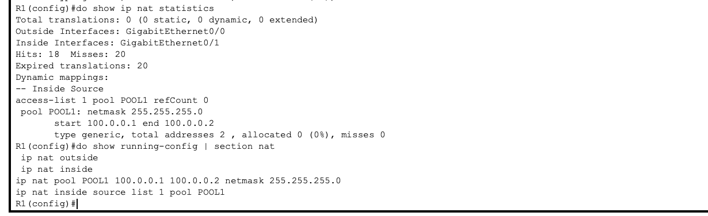
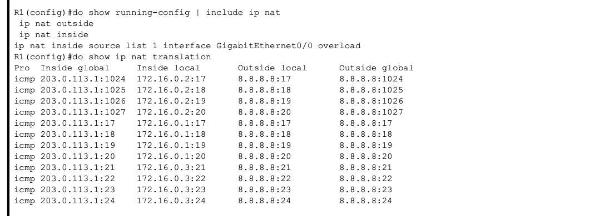

# Network Address Translation (NAT) – Traffic Translation and Scaling

Designed and implemented Network Address Translation to enable private networks to communicate with external networks, analyze translation behavior, and understand scalability limits in real-world designs.

---

## Overview

This project demonstrates how NAT operates at the network boundary and how different NAT types affect connectivity, scalability, and traffic flow.

The lab progresses through three stages:
- Static NAT (one-to-one translation)  
- Dynamic NAT (address pool translation)  
- Port Address Translation (PAT / NAT Overload)  

---

## Part 1 — Static NAT

### Topology

### Configuration Proof

- Defined NAT inside and outside interfaces on the router  
- Created static one-to-one mappings for internal hosts  
- Verified internal hosts can reach external destinations  

### Observed Behavior

- Static translations persist without active traffic  
- Each internal host consumes a unique public IP address  
- Static NAT does not scale for large numbers of hosts  

---

## Part 2 — Dynamic NAT

### Topology

### Configuration Proof

- Configured dynamic NAT using a limited public IP pool  
- Allowed internal hosts to share addresses dynamically  
- Observed translation allocation and release  

### Validation

- First internal hosts successfully translated and reached the internet  
- Additional hosts failed once the NAT pool was exhausted  

### Observed Behavior

- NAT pool exhaustion prevents new translations  
- Clearing translations temporarily restores connectivity  
- Dynamic NAT improves efficiency but remains limited under load  

---

## Part 3 — Port Address Translation (PAT)

### Topology

### Configuration Proof

- Enabled NAT overload using a single public IP address  
- Allowed all internal hosts to share one external address  
- Verified simultaneous connectivity from multiple hosts  

### Observed Behavior

- Traffic is differentiated using source port numbers  
- Multiple translations exist per public IP  
- PAT enables large-scale outbound connectivity  

---

## Validation

### Connectivity Testing

- Internal hosts successfully reach external destinations  
- Traffic fails when translations are unavailable  
- Connectivity is restored after enabling PAT  

---

## Key Takeaways

- NAT enables private networks to access external networks  
- Static NAT is predictable but inefficient  
- Dynamic NAT introduces address contention  
- PAT solves scalability through port multiplexing  
- NAT translations are stateful and traffic-driven  
- NAT is a connectivity mechanism, not a security control  

---

## Environment

- Cisco Packet Tracer
