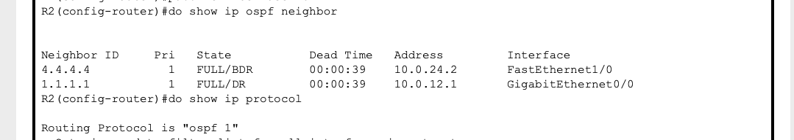
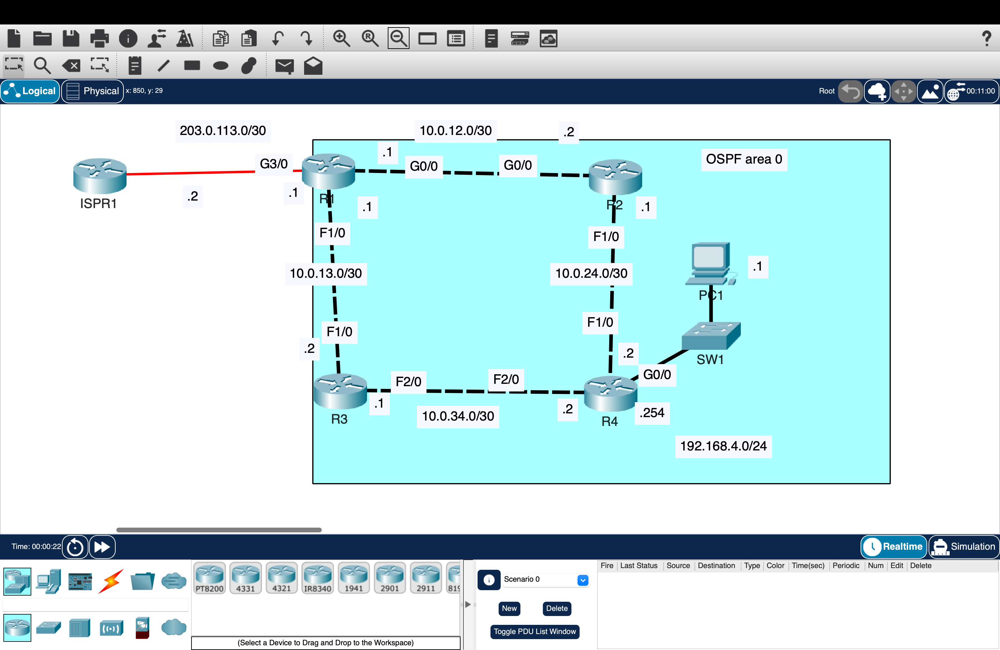
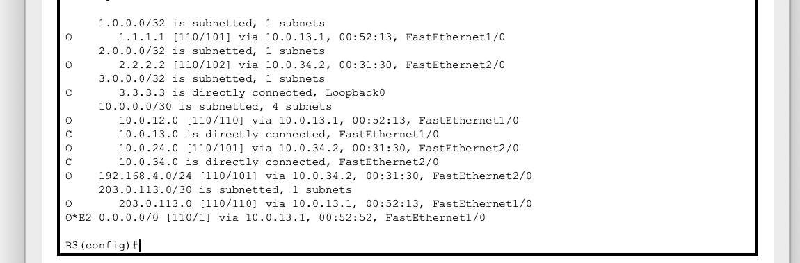
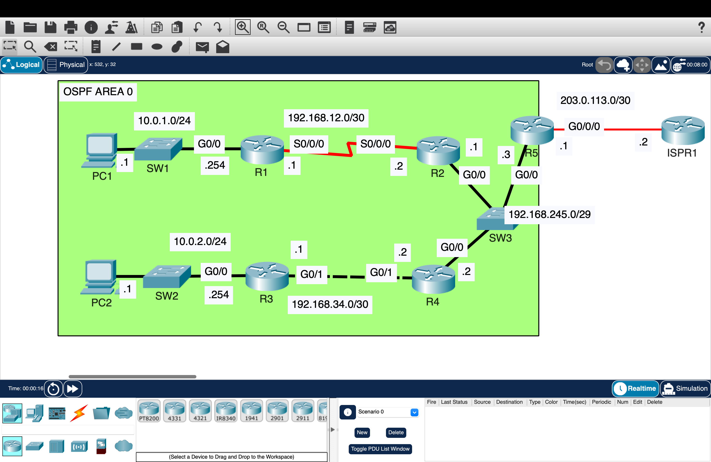
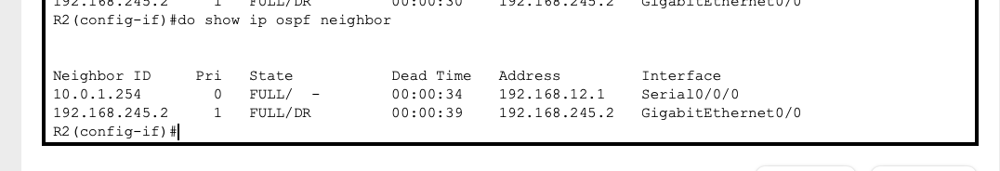
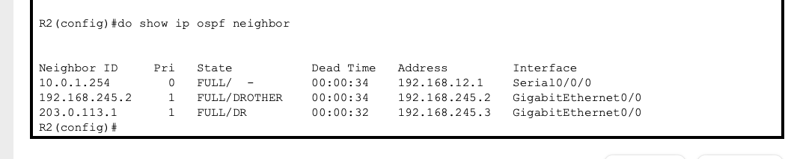

# OSPF – Dynamic Routing, Path Control, and Troubleshooting

Designed and implemented OSPF across multiple topologies to enable dynamic route learning, control path selection, and troubleshoot routing issues in a multi-router environment.

---

## Overview

This project demonstrates how OSPF allows routers to dynamically exchange routing information, build a shared network view, and select paths based on cost.

The lab progresses through three stages:

- OSPF neighbor formation and route advertisement  
- Path selection and OSPF cost control  
- OSPF troubleshooting and network recovery  

---

## Part 1 — OSPF Neighbor Formation and Route Advertisement

### Topology

### Configuration Proof

- Configured hostnames and IP addressing across all routers  
- Enabled OSPF on all internal interfaces (Area 0)  
- Configured loopback interfaces for router identification  
- Verified OSPF neighbor adjacencies formed successfully  
- Observed routers establish communication before exchanging routing data  

---

## Part 2 — Path Selection and OSPF Control

### Topology

### Configuration Proof

- Verified routers learned remote networks dynamically through OSPF  
- Observed OSPF routes appear in the routing table  
- Confirmed end-to-end connectivity across multiple routed networks  
- Configured reference bandwidth to standardize cost values  
- Modified interface cost to influence route selection  
- Configured R1 as an ASBR to advertise a default route  
- Verified default route propagation across routers  

---

## Part 3 — OSPF Troubleshooting and Network Recovery

### Topology

### Configuration Proof

- Diagnosed missing routes and corrected OSPF configuration issues  
- Identified and fixed neighbor adjacency problems  
- Resolved routing inconsistencies preventing connectivity  
- Verified routing behavior after fixes  
- Examined the LSDB to understand how OSPF stores network information  

---

## Validation

- OSPF Neighbor Verification  
- Routing Table Verification  
- Ping Test  

- Confirmed routers formed OSPF adjacencies successfully  
- Verified remote networks were learned dynamically  
- Confirmed traffic reached internal and external destinations  
- Observed routing changes after modifying cost and fixing topology issues  

---

## Key Takeaways

- OSPF is a link-state routing protocol that builds a full network map using LSAs  
- Routers must form neighbor adjacencies before exchanging routing information  
- OSPF selects the best path based on cost, not hop count  
- Reference bandwidth and interface cost directly influence path selection  
- Default routes can be injected into OSPF using an ASBR  
- Troubleshooting OSPF requires verifying neighbors, routes, and the LSDB  

---

## Environment

Cisco Packet Tracer
