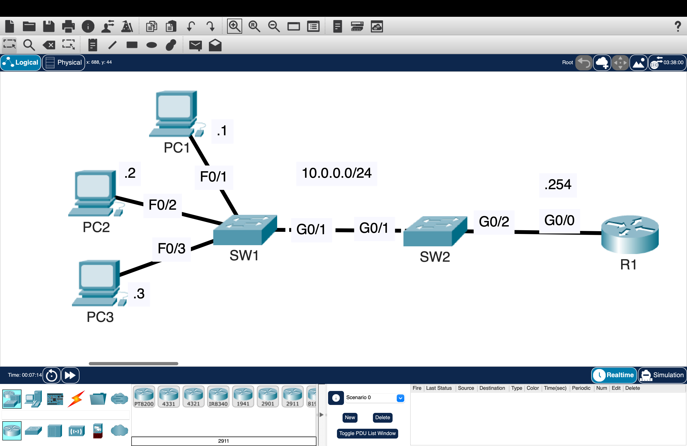
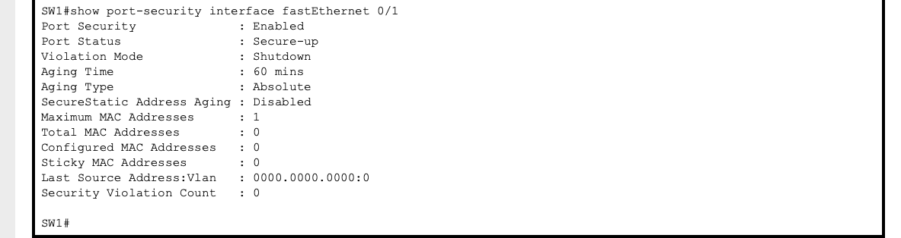
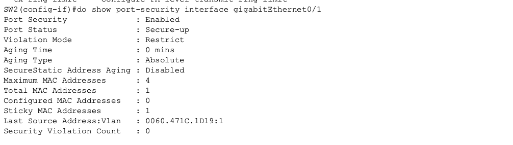

# Port Security – Securing Layer 2 Access Ports

Configured Cisco Port Security to restrict unauthorized devices from connecting to switch access ports by limiting secure MAC addresses and enforcing different violation actions.

---

## Overview

This lab demonstrates how Port Security protects Layer 2 access ports by controlling which MAC addresses are permitted to communicate through a switch.

The lab compares different security policies to observe how switches respond to unauthorized devices and how secure MAC addresses are learned and enforced.

Topics covered:

- Port Security
- Secure MAC Addresses
- Sticky MAC Learning
- Violation Modes
- Interface Recovery
- Verification & Troubleshooting

---

## Topology

---

# Part 1 — Shutdown Mode

## Configuration

Configured Port Security on SW1 access ports.

### Security Policy

- Interfaces: Fa0/1, Fa0/2, Fa0/3
- Maximum secure MAC addresses: 1
- Sticky learning: Disabled
- Aging: 1 hour
- Violation mode: Shutdown

---

## Configuration Proof

Verified using:

- `show port-security`
- `show port-security interface`
- `show port-security address`

---

## Validation

### Tests Performed

- Connected authorized devices
- Connected an unauthorized device
- Verified interface status
- Verified violation counters

### Result

- Authorized devices were allowed.
- Unauthorized devices caused the interface to enter the err-disabled state.
- Connectivity was restored after manually resetting the interface.

---

# Part 2 — Restrict Mode with Sticky Learning

## Configuration

Configured Port Security on SW2.

### Security Policy

- Interface: Gi0/1
- Maximum secure MAC addresses: 4
- Sticky MAC learning: Enabled
- Violation mode: Restrict

---

## Configuration Proof

Verified using:

- `show port-security`
- `show port-security address`
- `show running-config interface g0/1`

---

## Validation

### Tests Performed

- Learned secure MAC addresses using sticky learning
- Connected an unauthorized device
- Verified interface status
- Verified violation counters

### Result

- Authorized MAC addresses were automatically learned.
- Unauthorized traffic was dropped.
- The interface remained operational.
- Violation counters increased while legitimate traffic continued.

---

## Comparison

| Feature | Shutdown | Restrict |
|----------|----------|----------|
| Unauthorized traffic | Dropped | Dropped |
| Interface status | Err-disabled | Up |
| Violation counter | Yes | Yes |
| Manual recovery required | Yes | No |

---

## Key Takeaways

- Port Security restricts network access using MAC address filtering.
- Sticky learning automatically converts dynamically learned MAC addresses into secure MAC addresses.
- Shutdown mode prioritizes security by disabling the interface after a violation.
- Restrict mode blocks unauthorized traffic while allowing legitimate devices to continue communicating.
- Verification commands are essential for confirming Port Security operation and diagnosing violations.

---

## Environment

- Cisco Packet Tracer
