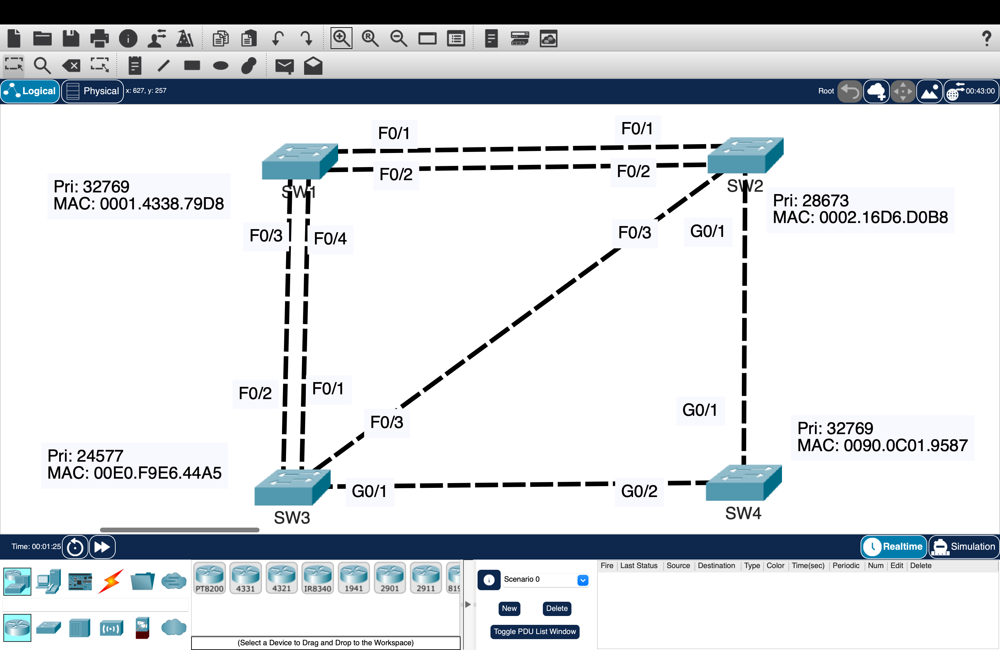
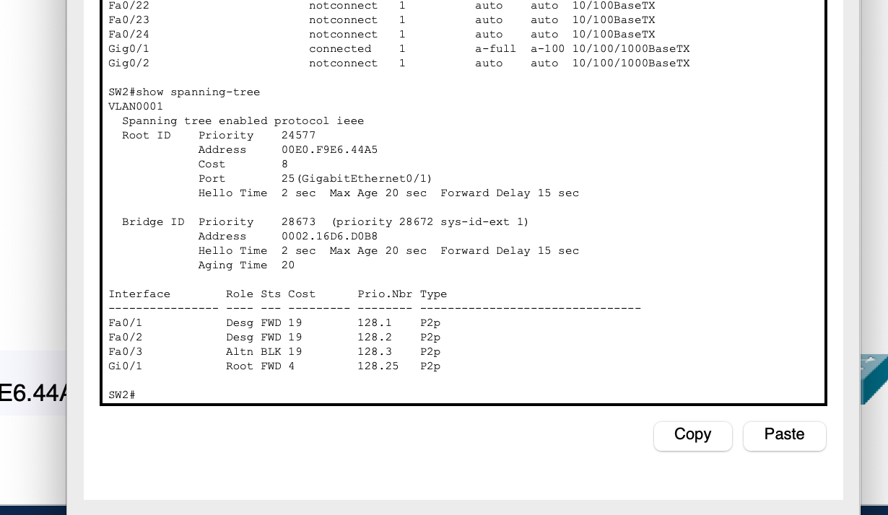
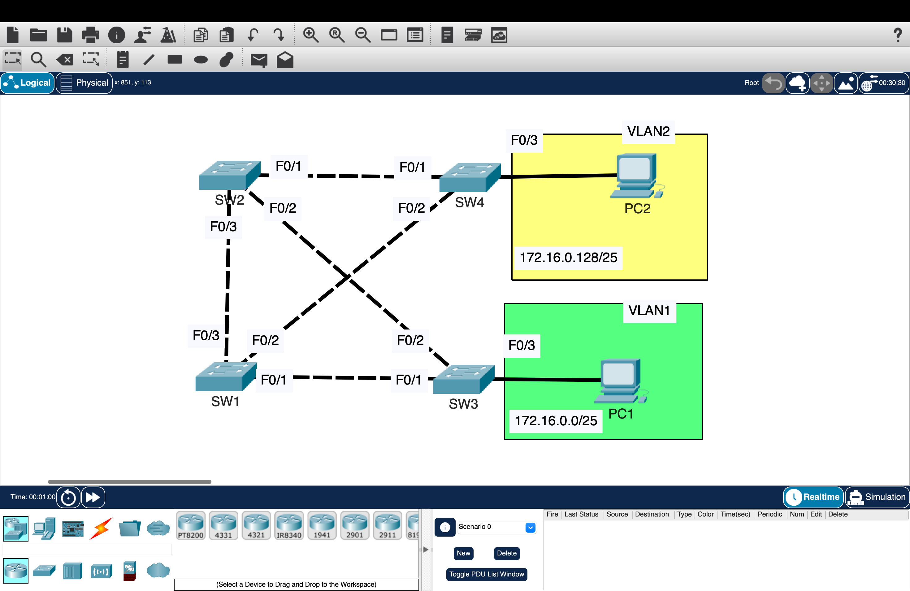
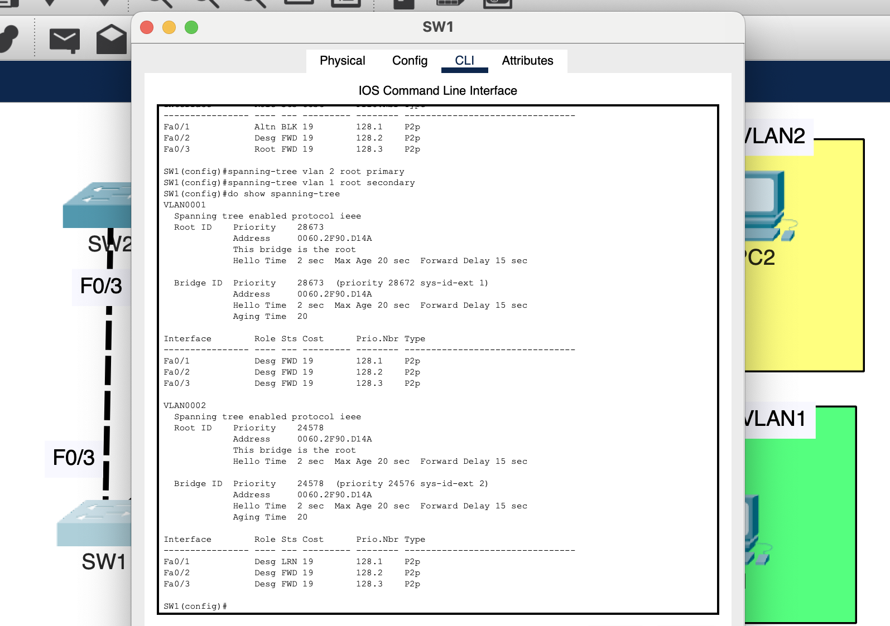
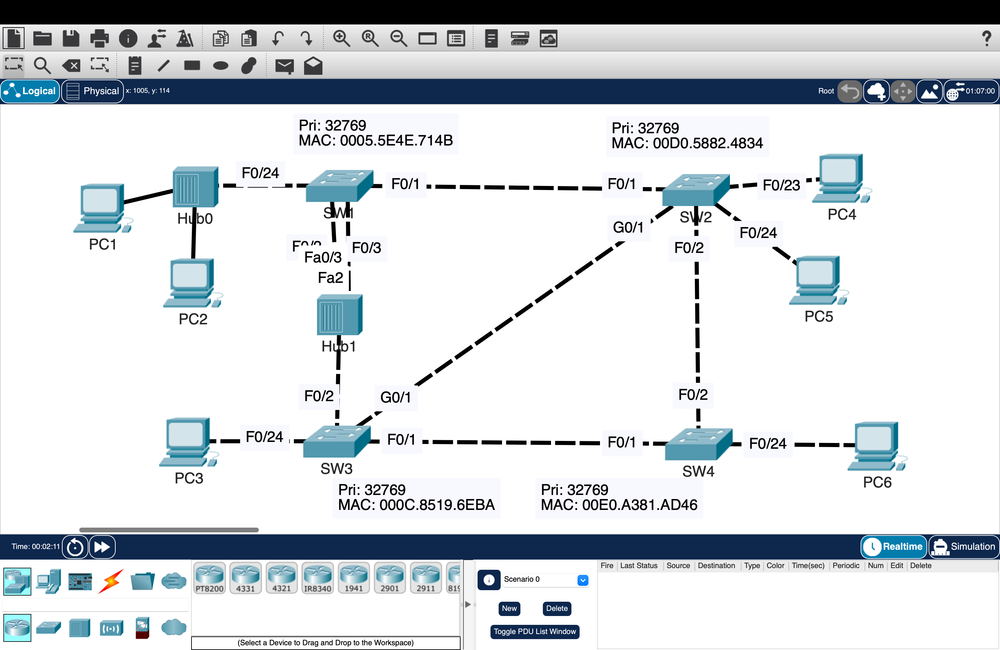
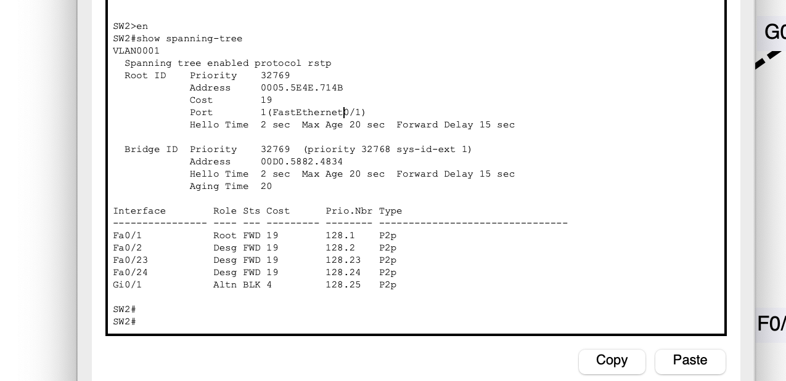

# Spanning Tree Protocol (STP) and RSTP – Loop Prevention and Network Control

Designed and analyzed redundant Layer 2 topologies using STP and RSTP to prevent loops, control traffic flow, and improve network stability.

---

## Overview

This project demonstrates how Spanning Tree Protocol (STP) prevents Layer 2 loops and how network paths are determined in topologies with redundant links.

The lab progresses through three stages:
- STP fundamentals (root bridge and port roles)  
- STP manipulation (cost, priority, and root control)  
- RSTP behavior (fast convergence and link types)  

---

## Part 1 — STP Fundamentals

### Topology

### Configuration Proof

- Built a multi-switch topology with redundant links  
- Observed STP elect a root bridge based on lowest bridge ID  
- Identified port roles:
  - Root Port (best path to root)  
  - Designated Port (forwarding on each segment)  
  - Non-designated (blocked) port to prevent loops  

---

## Part 2 — STP Manipulation

### Topology

### Configuration Proof

- Configured root primary and secondary for different VLANs  
- Adjusted interface cost to influence path selection  
- Modified port priority to control port roles  

- Configured:
  - PortFast (immediate forwarding on access ports)  
  - BPDU Guard (disables ports receiving unexpected BPDUs)  

---

## Part 3 — RSTP Behavior

### Topology

### Configuration Proof

- Observed faster convergence compared to traditional STP  
- Identified link types:
  - Point-to-point (switch-to-switch)  
  - Edge (host-facing ports)  

- Verified reduced delay in port state transitions  

---

## Validation

### STP State Verification

- Confirmed root bridge election  
- Verified correct port roles and states  
- Observed blocked ports preventing loops  
- Confirmed topology recalculates when cost or priority changes  

---

## Key Takeaways

- Redundant Layer 2 links create loops without STP  
- STP builds a loop-free topology using root bridge and port roles  
- Path selection is based on cost, not hop count  
- Network behavior can be controlled through cost and priority  
- PortFast and BPDU Guard improve edge stability and security  
- RSTP improves convergence and recovery time  

---

## Environment

- Cisco Packet Tracer
