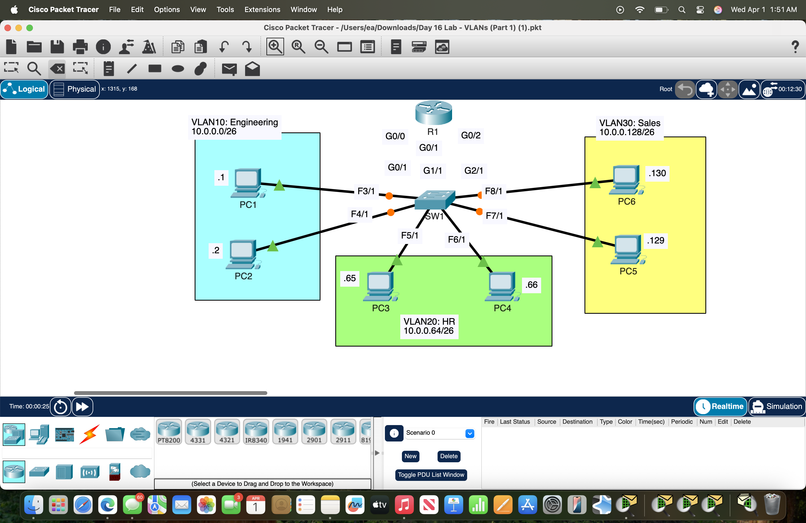
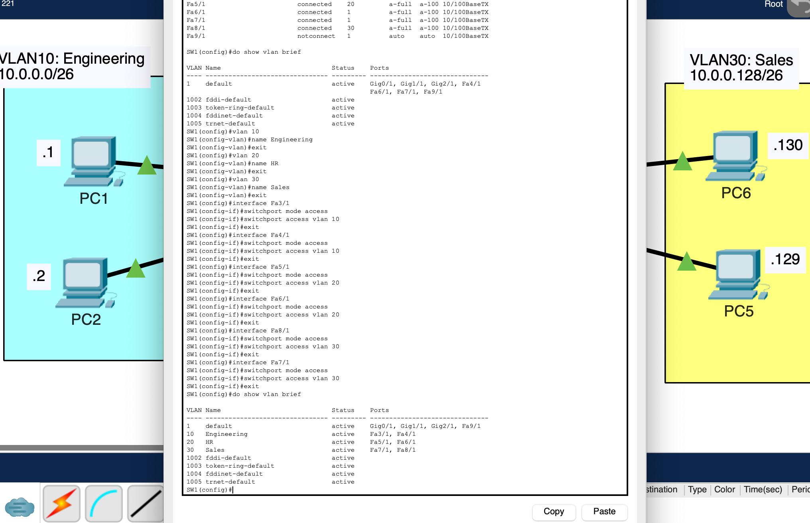
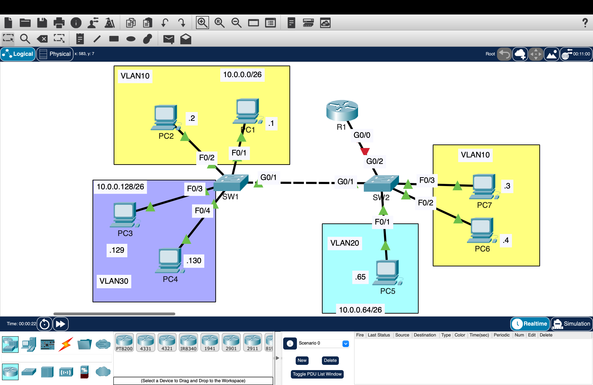
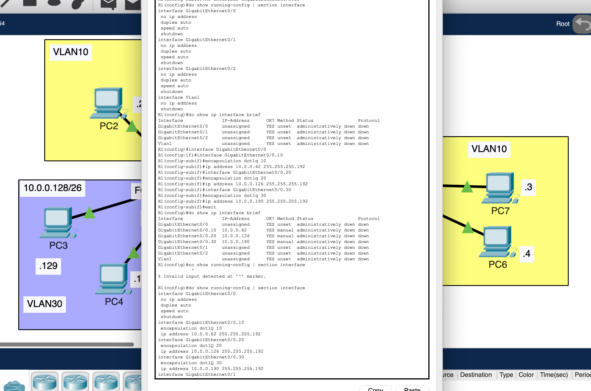
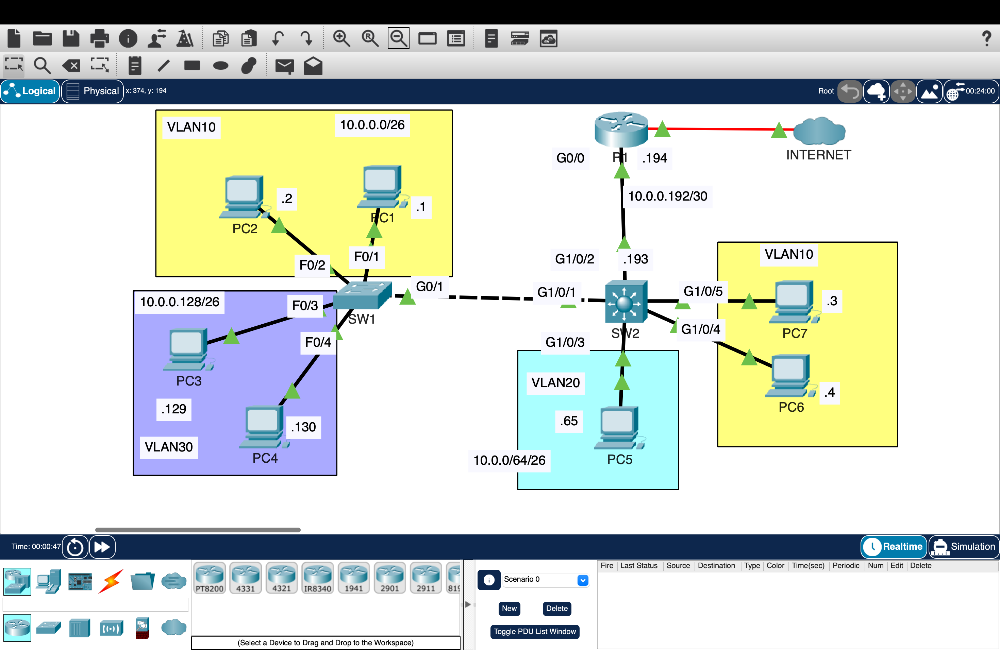
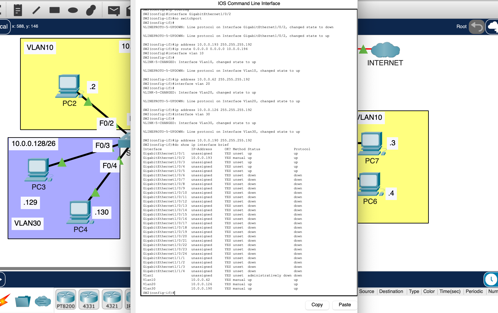
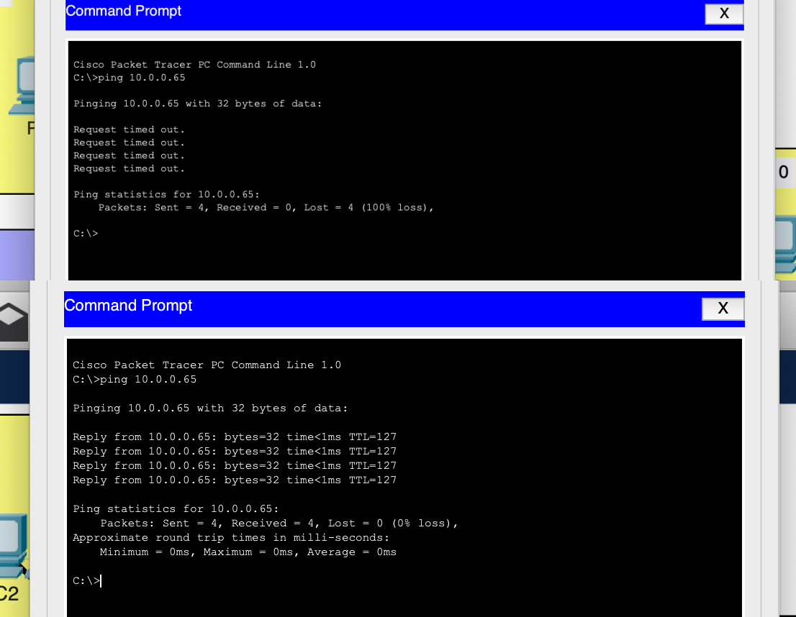

# Network Segmentation with VLANs and Inter-VLAN Routing

Designed and implemented network segmentation using VLANs, trunking, and Layer 3 routing to control communication between departments.

---

## Overview

This project demonstrates how a network is segmented using VLANs and how communication between networks is enabled through routing.

The lab progresses through three stages:
- VLAN segmentation  
- Inter-VLAN routing (router-on-a-stick)  
- Layer 3 switching  

---

## Part 1 — VLAN Segmentation

### Topology

### Configuration Proof

- Created VLAN 10 (Engineering), VLAN 20 (HR), VLAN 30 (Sales)  
- Assigned switch ports to each VLAN  
- Verified devices in different VLANs cannot communicate directly - traffic must go through a router 

---

## Part 2 — Inter-VLAN Routing (Router-on-a-Stick)

### Topology

### Configuration Proof

- Configured subinterfaces for each VLAN  
- Assigned gateway IP addresses  
- Enabled communication between VLANs  

---

## Part 3 — Layer 3 Switching

### Topology

### Configuration Proof

- Configured Switch Virtual Interfaces (SVIs)  
- Enabled routing directly on the switch  
- Improved efficiency by removing router dependency  

---

## Validation

### Connectivity Test

- Devices in the same VLAN communicate successfully  
- Devices in different VLANs are isolated before routing  
- Devices can communicate after routing is enabled  

---

## Key Takeaways

- VLANs segment networks and isolate traffic at Layer 2  
- Port assignment determines VLAN membership  
- Inter-VLAN routing enables communication between networks  
- Layer 3 switching improves performance and scalability  
- Network segmentation is essential for security and control  

---

## Environment

- Cisco Packet Tracer
